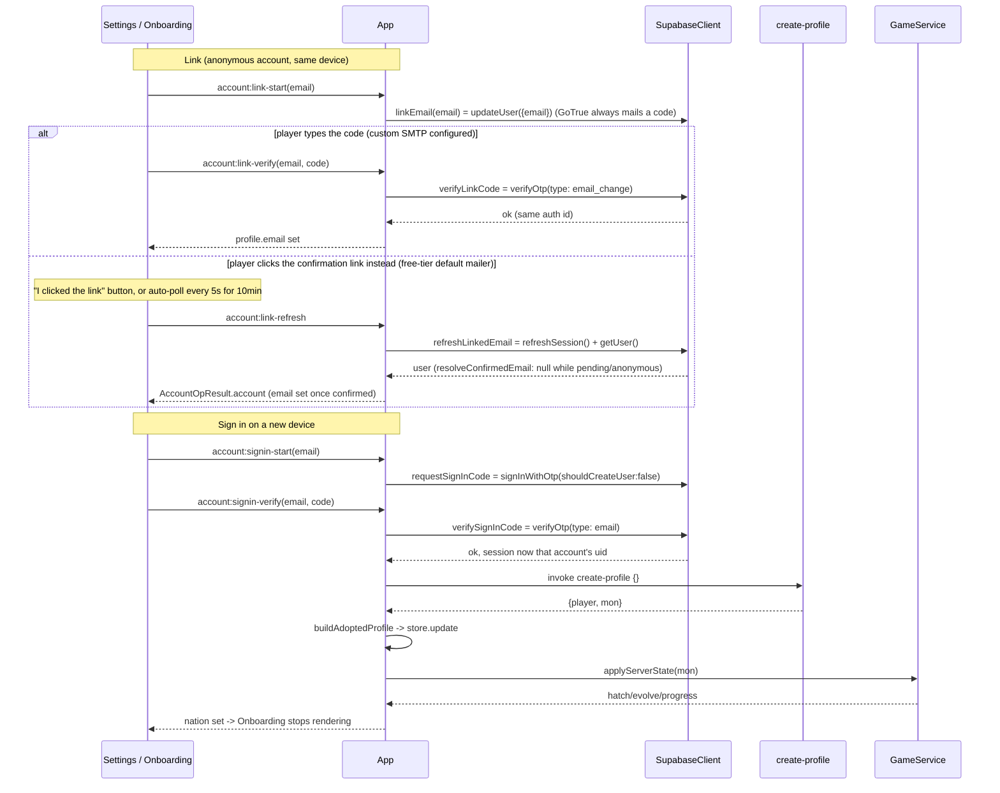

# Account linking

Optional email linking (`docs/decisions/0016-email-otp-account-linking.md`) so the same mon can be
used on a second machine — no password, only 6-digit codes typed into the panel; no deep links, no
browser redirects. Three flows share one `SupabaseClient` surface
(`apps/desktop/src/main/net/SupabaseClient.ts`): link, sign in on a new device, sign out.

## Link (attach an email to this device's anonymous account)

Settings' Account section (`apps/desktop/src/renderer/panel/views/Settings.tsx`), shown whenever
`UiSnapshot.account.anonymous` is true, renders `AccountEmailCode`
(`apps/desktop/src/renderer/ui/AccountEmailCode.tsx`) wired to `IPC.accountLinkStart`/`accountLinkVerify`.
`App.registerUiIpc`'s handler calls `SupabaseClient.linkEmail(email)`
(`client.auth.updateUser({ email })`) — this sends a code but does **not** change the auth id, so
nothing about `players`/`mons` changes yet. On verify, `SupabaseClient.verifyLinkCode` tries
`verifyOtp` with `type: 'email_change'` first (confirmed correct against @supabase/auth-js's
GoTrueClient docs — see the ADR), falling back to `signup`/`email` only if that fails. Success just
sets `LocalState.profile.email` locally; the server-side profile is untouched.

### Fallback: confirmation-link click instead of a typed code

Custom SMTP is configured as of 2026-09-23 (`docs/runbooks/auth-email-config.md`), so the link-email
and sign-in emails carry the typed 6-digit code as the expected path. The link-click fallback below
remains as a resilience path (e.g. if a player's mail client shows the link more prominently than the
code, or if custom SMTP is ever removed): `linkEmail` always makes GoTrue generate a real code, and
clicking the confirmation link in the email confirms the email change server-side for the existing
(anonymous → now permanent) user directly, with no code involved at all:

- `SupabaseClient.refreshLinkedEmail()` calls `auth.refreshSession()` (best-effort — failure is
  ignored) then `auth.getUser()`, which round-trips to the Auth server and so observes a confirmation
  the player just completed in their mail client, unlike the locally cached session. It returns the
  confirmed email via the pure `resolveConfirmedEmail(user)` (`apps/desktop/src/main/net/account.ts`),
  which returns null while `user.is_anonymous` is still true *or* `user.new_email` shows a change is
  still pending — a stale/cached user object must never surface that pending value as confirmed.
- `IPC.accountLinkRefresh` (`account:link-refresh`) has no arguments; `App.registerUiIpc`'s handler
  calls `refreshLinkedEmail()`, and if it resolves to an email, persists `LocalState.profile.email`
  and pushes a snapshot exactly like a successful `accountLinkVerify`. The result always carries the
  post-check `UiSnapshot.account` (`AccountOpResult.account`) so the caller can tell immediately
  whether the link was actually clicked, without waiting for the next snapshot push.
- `AccountEmailCode`'s `linkFallback` prop (used only by the link widget in Settings, not by either
  sign-in widget) renders a hint plus an "I clicked the link" button calling `account:link-refresh`,
  and auto-polls the same call every 5 s for up to 10 minutes while the code step is visible — so the
  UI completes itself as soon as the click lands, with no button press required. Both the button and
  the poll stop once `account.anonymous` comes back false.
- Signing in on a second device has **no** equivalent fallback: `verifySignInCode` only ever accepts
  a typed code. That now works end-to-end since custom SMTP delivers the code; `AccountEmailCode`'s
  `signinHint` prop shows a one-line explanation next to both sign-in widgets (Settings' "sign in
  instead" and Onboarding's "Already have a mon? Sign in") if it is ever unreachable again.

## Sign in on a new (or different) device

Two entry points, same underlying calls:

- **Onboarding**, before any nation is chosen (`profile.nation` is still null): the Welcome step has
  a secondary "Already have a mon? Sign in" button (`apps/desktop/src/renderer/panel/views/Onboarding.tsx`'s
  `SignInSubStep`) that replaces the whole wizard while active. No "replace this device" confirm is
  shown here — there is nothing local to replace yet.
- **Settings**, when this device already has a nation chosen (anonymous or already linked to a
  *different* email): a "sign in instead" link, gated behind an explicit confirm ("This replaces the
  mon on this device...") before the email/code form even renders, since this path *does* discard a
  local player.

Both call `IPC.accountSigninStart`/`accountSigninVerify` → `SupabaseClient.requestSignInCode`
(`signInWithOtp({ email, options: { shouldCreateUser: false } })`, so a mistyped or never-linked email
never creates a new anonymous-turned-permanent account) → `verifySignInCode` (`verifyOtp({ type:
'email' })`). A successful verify switches the *session* to the target account's existing auth id;
`App.adoptProfile` then pulls that account's server state onto this device:

1. `api.invoke('create-profile', {})` — an empty body on an *existing* profile just returns
   `{ player, mon }` for the caller's own session; nothing is created or renamed.
2. `buildAdoptedProfile` (`apps/desktop/src/main/net/account.ts`, pure) replaces
   `profile`/`pet`/`progress`/`ledger`/`streak`/`bonusXp`/`battleXp`/`battles` with a from-scratch
   baseline (`stage: 'egg'`, `speciesId: null`, `localXp: 0`) plus the server's `nickname`/`nation`/`email`
   — never mixing in whatever this device's previous local player had pending.
3. `GameService.applyServerState` (already used by ordinary sync reconciliation,
   `docs/architecture/flows/server-reconciliation.md`) derives `stage`/`speciesId`/`localXp` purely
   from the server's `MonState`, so hatch/evolve fire through the same tested path as a normal sync.
4. `PetHost.setNation` reveals the (until now hidden, or previously differently-tinted) pet window.
   Because the hatch-animation handler in `App.wireGameEvents` always lands on `'baby'` after the
   crack animation regardless of the true target stage, `adoptProfile` schedules one extra
   `PetHost.setStage(mon.stage, mon.speciesId)` 100 ms after that handler's own delay, correcting the
   sprite for an adopted mon that was already teen/adult on the other device.

The previous local anonymous player (if any) is not deleted — its `players`/`mons` rows stay on the
server, simply never referenced by any device again ("orphaned"; see
`docs/runbooks/delete-a-player.md` for owner-initiated cleanup).

## Sign out (return to anonymous)

`IPC.accountSignout` → `SupabaseClient.signOutToAnonymous` (`client.auth.signOut()`) plus
`resetToAnonymousProfile` (same shape as `buildAdoptedProfile`, pure, injected with a fresh PRNG seed)
writes a blank local profile, hides the pet window, and reopens onboarding. The next `ensureSession()`
call creates a brand-new anonymous user — this device's linked mon stays reachable only by signing
back in with the same email.

## Signed out

Distinct from the voluntary sign-out above: an *involuntary* signed-out state for a device that has a
known account but no valid Supabase session. supabase-js rotates the refresh token on every refresh;
if the app is killed before the rotated token is persisted, the next launch presents an
already-invalidated token, GoTrue rejects it, and the client is left with no session. Historically
`ensureSession()` then signed in anonymously and `create-profile` minted a *new* player over the real
one, resetting XP to ~0 (2026-09 incident). Two changes prevent that:

- **Persistence:** the session is now written synchronously on every auth change and on `before-quit`
  (`JsonStore.flushSync`, see `server-reconciliation.md`), so a rotated token is not lost to the
  debounce.
- **Fail closed:** `authActionOnLostSession` (`apps/desktop/src/main/net/account.ts`, pure) returns
  `'signed-out'` whenever `profile.userId` or `profile.email` is set, and only `'anonymous'` for a
  device that never had an account. `SupabaseClient.ensureSession` throws `SignedOutError` in the
  first case instead of signing in anonymously; `SyncQueue` catches it (and a `NO_PROFILE` for a
  known account) via `enterSignedOut()`: it stops flushing (the local XP ledger keeps buffering),
  emits `signedout`, and `App` sets `UiSnapshot.account.signedOut`.

The panel then renders `SignedOutBanner` (`apps/desktop/src/renderer/ui/SignedOutBanner.tsx`) above
every tab: "Signed out of &lt;nickname&gt; — sign in again to continue", with the shared
`AccountEmailCode` sign-in widget (pre-filled with `profile.email` when linked; a never-linked mon
shows only a note that it can't be signed back in) plus an explicit **Start fresh instead**
(`IPC.accountStartFresh`) that abandons the old identity and lets a fresh anonymous player be created
— what used to happen silently. Signing back in (`adoptProfile`) or starting fresh clears the flag and
calls `SyncQueue.resume()`. Every transition is logged to `<userData>/auth.log` (`App.authLog`, capped)
so the next incident is diagnosable without a debug build. Two devices sharing one linked email are
unaffected: refresh-token rotation makes each device's session independent.

## Sequence

