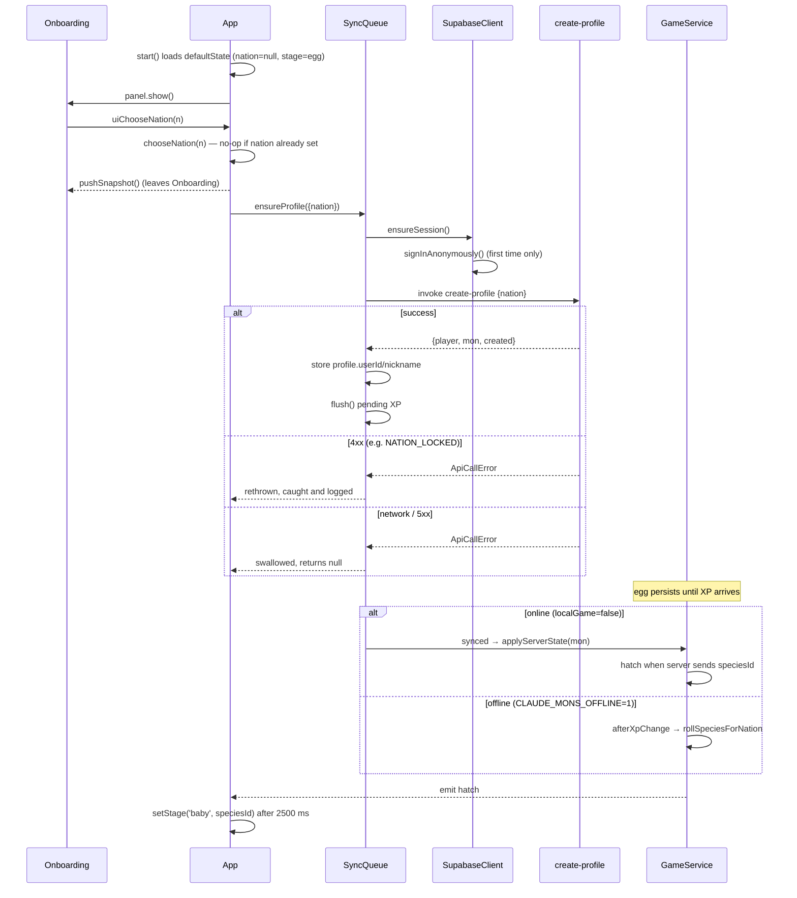

# Onboarding flow

First launch to a hatched mon: default local state, a permanent nation choice, anonymous
Supabase auth, profile creation on the server, and the egg-to-baby hatch — decided by the server
when a backend is configured, or locally in offline builds.

## Walk-through

`App.start` (`apps/desktop/src/main/App.ts:start`) loads `store.load()`, which returns
`defaultState()` (`apps/desktop/src/main/persistence/state.ts`) on first run: `profile.nation` is
`null`, `progress.stage` is `'egg'`. `backendConfig()` (`apps/desktop/src/main/net/config.ts`)
picks the Supabase URL/anon key unless `CLAUDE_MONS_OFFLINE=1`, in which case it returns `null` and
`App.start` never constructs a `SupabaseClient`. `GameService` is built with
`localGame: !this.api` — that one flag decides who is authoritative for hatching, below.

Because `state.profile.nation` is null, `App.start` calls `this.panel.show()`. The panel renderer
(`apps/desktop/src/renderer/panel/App.tsx`) renders `Onboarding`
(`apps/desktop/src/renderer/panel/views/Onboarding.tsx`) whenever `snapshot.value.profile.nation`
is falsy — this check runs on every snapshot, not just at boot, so it also covers the (currently
unreachable in v1) case of a nation-less profile appearing later. `Onboarding` shows the four
nations from `NATION_INFO`/`speciesForNation` (species detail, palette and hatch rarity are covered
in `../../design/species-and-nations.md`, not restated here) and calls
`window.monsUi.chooseNation(n)` on click, disabling all four buttons while the call is in flight.

That IPC call (`IPC.uiChooseNation`) reaches `App.chooseNation`
(`apps/desktop/src/main/App.ts:chooseNation`), which is **idempotent by construction**: its first
line is `if (this.store.get().profile.nation) return;` — a second call with any nation, including
a race from a double-click, is a no-op once the field is set. The choice is permanent in v1; there
is no client or server path to change it later (`create-profile`'s own lock is described below).
On the first call it persists `profile.nation`, tells `PetHost.setNation` to retint the sprite,
fires a `game:levelup` stimulus purely for the on-screen celebration (no XP or level change), and
pushes a snapshot so the panel leaves `Onboarding` immediately — all of this is local and does not
wait on the network.

Still inside `chooseNation`, if a `SyncQueue` exists (i.e. a backend is configured) it kicks off
`this.sync.ensureProfile({ nation })` asynchronously. `SyncQueue.ensureProfile`
(`apps/desktop/src/main/net/SyncQueue.ts:ensureProfile`) first calls
`SupabaseClient.ensureSession()` (`apps/desktop/src/main/net/SupabaseClient.ts:ensureSession`),
which signs in anonymously (`client.auth.signInAnonymously()`) the first time there is no session,
and persists the resulting session through the `SessionStorage` adapter the caller supplied — in
`App.start` that adapter reads/writes `store.get().auth.session` / `s.auth.session = v`, so the
session lives in `<userData>/state.json` under the `auth` key, survives restarts, and is refreshed
by `autoRefreshToken: true`. `ensureSession` caches the resulting user id in memory for the process
lifetime.

With a session in hand, `ensureProfile` invokes the `create-profile` Edge Function
(`supabase/functions/create-profile/index.ts`) with `{ nation }`. For a brand-new player this
creates the `players` row (nation locked in from here on — a later `nation` that differs gets
`409 NATION_LOCKED`) and the `mons` row (the egg), returning a server-generated nickname
(`generateNickname`) since none was supplied. `SyncQueue.ensureProfile` stores the returned
`userId` into `profile.userId`, the returned nickname into `profile.nickname`, and — defensively —
`profile.nation` if it were somehow still unset, then emits `profile` (→ `App` re-pushes a
snapshot) and calls `flush()` to send any pending XP buckets right away.

If `create-profile` fails, `ensureProfile` catches the error: it always calls `setStatus` with
`lastError` set (surfaced in the panel as sync status), and only *rethrows* when the failure is a
4xx `ApiCallError` (`err.status < 500`); any other failure (network error, 5xx) is swallowed and
`ensureProfile` returns `null`. `App.chooseNation`'s `.catch` only logs a warning either way — the
nation choice and local egg already happened and are not rolled back. Separately,
`SyncQueue.flush` (the periodic path, not the onboarding path) treats an `ApiCallError` whose
`code === 'NO_PROFILE'` specially by clearing `profile.userId`/`profile.nickname` so the next flush
re-creates the profile; a nation that was never accepted server-side is retried by every later
`flush()`, since `flush` calls `ensureProfile` again whenever `!s.profile.userId || !s.profile.nickname`.

The egg sprite does not change until XP arrives — nothing in onboarding itself hatches it. From
there the two authority modes diverge:

- **Online** (`localGame: false`): the server decides. `SyncQueue`'s `synced` event carries
  `mon.speciesId`/`mon.stage` from the `ingest-xp` response; `GameService.applyServerState`
  (`apps/desktop/src/main/game/GameService.ts:applyServerState`) stores `speciesId` the first time
  the server sends a non-null one, stamps `hatchedAt`, and emits `hatch`. Stage only ever moves
  forward (`egg → baby → teen → adult`) and is taken from `serverStage` when present. See
  `../../design/backend-rules.md` (`## Server-side species roll`) for how the server itself decides
  when and what to roll — not restated here.
- **Offline** (`CLAUDE_MONS_OFFLINE=1`, `localGame: true`): `GameService.ingest`/`grantXp` run
  `afterXpChange` after every XP credit, which derives the target stage from `stageForLevel`
  locally; the first time that crosses from `egg` it calls `this.opts.rollSpecies(nation, seed)`
  (`rollSpeciesForNation` in `apps/desktop/src/main/game/species.ts`) to pick a species from the
  chosen nation's pool, then emits `hatch`.

Either path funnels through `App.wireGameEvents`'s `hatch` handler: it fires a `game:hatch` stimulus
(crack animation) immediately, then after 2500 ms calls `PetHost.setStage('baby', speciesId)` and
pushes a snapshot — the delay lets the crack animation finish before the sprite swaps.

## Sequence

## Where state lives

| What | Where |
|---|---|
| Nation, stage, XP, hatch timestamp | `<userData>/state.json` (`profile`, `progress`, `pet` — see `../../../apps/desktop/README.md` for the persistence model) |
| Supabase session (anonymous JWT) | `<userData>/state.json` → `auth.session`, via the `SessionStorage` adapter `App.start` passes to `SupabaseClient` |
| Server-side player/mon rows | Supabase `players`/`mons` tables, created by `create-profile`; see `../../design/backend-rules.md` |

For the Supabase Edge Function auth model (`requireUser`, service-role RPCs) see
`../../design/backend-rules.md`. For XP thresholds and stage levels
(`HATCH_XP`/`stageForLevel`), see `../../design/species-and-nations.md` and
`../../design/economy.md` — not restated here.
