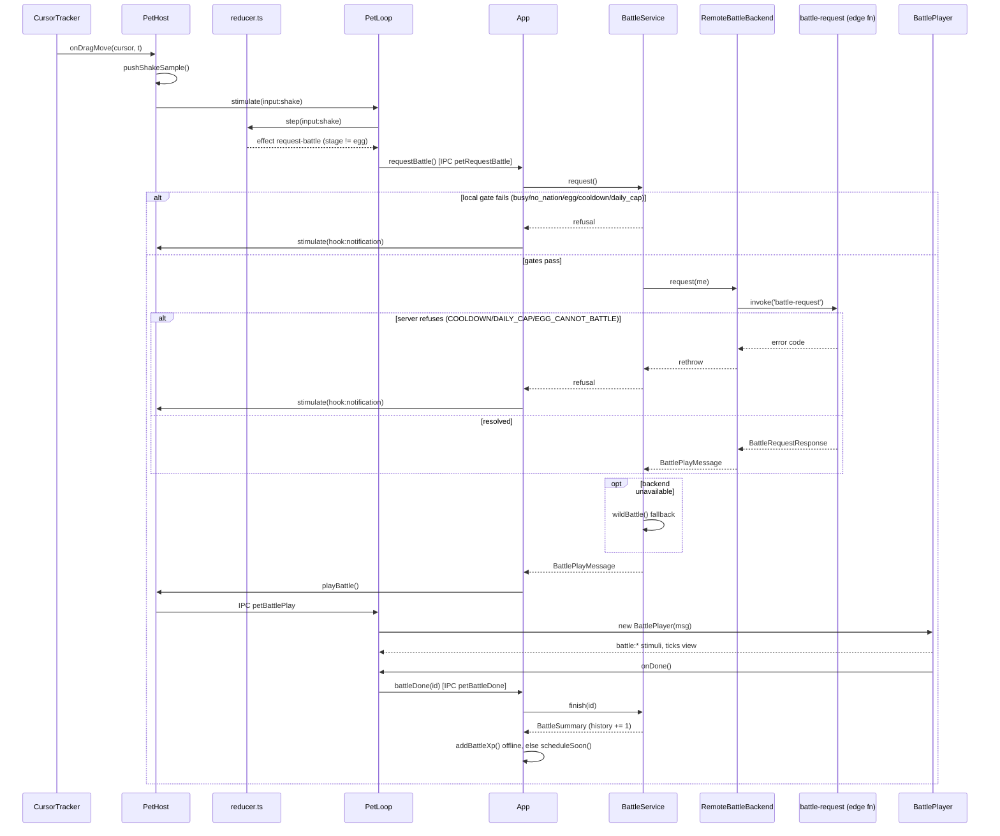

# Shake to battle

Grabbing the pet and shaking it is the only player-initiated path into a battle. This traces that
gesture from raw cursor samples to a `BattleSummary` in history. Battle math, matchmaking and reward
numbers are not restated here — see `docs/design/battle.md`.

## Detection: drag samples to shake verdict

While the pet is being dragged, `apps/desktop/src/main/input/CursorTracker.ts` polls the OS cursor
and streams positions into `apps/desktop/src/main/PetHost.ts:onDragMove`, which folds each `{t, x, y}`
sample into `packages/shared/src/input/shake.ts:pushShakeSample`. That function is pure and
stateless-in, stateless-out: it keeps a sliding window (`ShakeConfig.windowMs`), buckets the samples
into segments, picks the dominant axis (larger summed `|v|`), and counts sign reversals on that axis
among "fast" segments (`|v| >= minSpeed`). A `'shake'` verdict requires both enough reversals
(`minReversals`) and enough total travel (`minTravel`) on the dominant axis, and starts a
`cooldownMs` window before another `'shake'` can fire. A weaker `'shaking'` verdict (≥2 reversals)
fires earlier, purely to drive an in-progress wobble animation.

`onDragMove` turns the verdict into a stimulus: `'shaking'` → `input:shake-progress`, `'shake'` →
`input:shake` (`apps/desktop/src/main/PetHost.ts:onDragMove`).

## Reducer: gating on stage

`packages/shared/src/behavior/reducer.ts` handles both stimuli. `input:shake-progress` just nudges
the state machine toward `shaking` while dragged. `input:shake` always transitions state (even for an
egg, so the wobble still plays), but only pushes the `{type: 'request-battle'}` effect when
`model.stage !== 'egg'` — an egg shaking never reaches the IPC layer at all. This is the first of two
independent egg gates; the second is inside `BattleService` below, reachable only through the
`--dev-battle` CLI flag, which calls the battle path directly and skips the reducer.

## From effect to request, gates, and refusal

`apps/desktop/src/renderer/pet/loop.ts` (`PetLoop.step`) sees the `request-battle` effect and calls
`window.mons.requestBattle()`, which crosses into the main process as `IPC.petRequestBattle` and
lands in `apps/desktop/src/main/App.ts:onBattleRequest`, which calls
`apps/desktop/src/main/game/BattleService.ts:request`. That method checks gates in a
fixed order, short-circuiting on the first one that fails:

| Order | Gate | Refusal reason |
|---|---|---|
| 1 | a battle is already in flight (`this.pending`) | `busy` |
| 2 | no nation chosen yet | `no_nation` |
| 3 | `mySnapshot()` is null (no species, or stage is `egg`) | `egg` |
| 4 | `cooldownUntil()` is in the future | `cooldown` |
| 5 | `remainingToday()` is `0` | `daily_cap` |

`mySnapshot()` also stamps `loadout: { stance, moves?, tree? }` onto the `MonSnapshot` it builds,
from `LocalState.loadout` (set by `IPC.battleSetStance` / `IPC.battleSetLoadout` — `docs/design/
progression.md` Stances / Move pool and effects, `docs/design/talent-tree.md` for `tree`). `moves`/
`tree` are usually `undefined` locally (the client mostly relies on the server-computed move
default and an empty tree; the loadout editor sets them explicitly once the player saves); either
way `snapshotFor` (`packages/shared/src/battle/battle.ts`) fills in a level-appropriate move
default before the snapshot ever reaches `simulateBattle` (an absent `tree` just resolves to no
bonuses for a real player's mon, or `defaultBotTree` for a Wild Mon), so both the offline
`wildBattle` path and the snapshot sent to `battle-request` always battle with a complete loadout.

Any refusal (`BattleOutcome` with `ok: false`) is shown the same way: `App.onBattleRequest` plays a
short "hurt" pose (`this.host.stimulate({ type: 'hook:notification' })`) so the player learns the
shake was understood but rejected, then pushes a fresh `UiSnapshot`.
`apps/desktop/src/renderer/panel/views/Battles.tsx` separately renders the live cooldown countdown
and `remainingToday` from that snapshot so the reason is visible without waiting for another shake.

## Resolution: server battle-request, or a wild fallback

Once past the local gates, `BattleService.request` asks the backend
(`apps/desktop/src/main/net/Backend.ts:request`), which invokes the
`supabase/functions/battle-request/index.ts` Edge Function. That function re-derives the same gates
server-side (`claim_battle_slot` RPC) and returns `COOLDOWN` / `DAILY_CAP` / `EGG_CANNOT_BATTLE` as
typed errors on the exact same conditions — the client cannot out-race its own cooldown by calling
the server directly. `RemoteBattleBackend` rethrows those three codes so `BattleService` turns them
into the same refusals as above; any other failure (offline, network error, unrecognized code) is
swallowed and treated as "no backend," and `BattleService.wildBattle` runs an offline battle against
a same-level Wild Mon from another nation instead (always `isElite: false` — there is no
matchmaking service to roll an elite wild mon offline). The server path picks a real opponent
(`findOpponent`, widening level windows) or its own wild-mon fallback (`wildMon`,
`supabase/functions/battle-request/index.ts`) when none is found; that fallback rolls a 10 % chance
of an elite encounter (`ELITE_CHANCE`), which fixes the wild mon's level at `+3` instead of the
usual `±` random spread and, on a win, doubles the challenger's XP reward (`isElite` on the returned
`BattlePlayMessage`/`BattleSummary`) — see `docs/design/battle.md` for the opponent search and
reward rules.

## Determinism guarantee

Either path ends in `simulateBattle(me, opponent, seed)` (`packages/shared/src/battle/battle.ts`),
seeded with the battle's own id — server-generated for a remote battle, `randomUUID()` client-side
for a wild fallback. Given the same two `MonSnapshot`s and the same seed, `simulateBattle` reproduces
the exact same turn-by-turn log on both client and server; nothing about playback (below) can change
the outcome, only how it is paced on screen. The RNG call order and cross-runtime determinism
guarantee are `docs/design/battle.md`'s to state.

## Playback: BattlePlayMessage to BattlePlayer

A successful `BattleOutcome` (`{ok: true, play}`) is stashed as `BattleService.pending` and handed to
`PetHost.playBattle`, which first switches the pet window into the **battle** arena
(`PetWindow.enterBattle`, `apps/desktop/src/main/display.ts:battleBounds`) before sending
`IPC.petBattlePlay` to the pet renderer — the arena is a generously-sized box (see
`docs/architecture/overlay-window.md`'s "One window, always compact"), not the small `follow`
square used the rest of the time, so the opponent, hp bars, popups and banner all have room.
`PetHost` reverts to `follow` (`PetWindow.enterFollow`) on `IPC.petBattleDone` and ignores a
pointer-down that would otherwise start a drag out from under an in-progress battle.
`PetLoop.playBattle` constructs a `BattlePlayer`
(`apps/desktop/src/renderer/pet/BattlePlayer.ts`), which turns the already-resolved `BattleResult.turns`
into a time-based schedule — robust to dropped frames because every step carries an absolute `at` (ms
since playback start) rather than being driven frame-by-frame:

| Phase | Duration | Constant |
|---|---|---|
| Intro (opponent slides in, banner shows challenge) | 1200 ms | `INTRO_MS` |
| Per action (attack pose, banner updates) | 700 ms | `ACTION_MS` |
| Hit delay (damage/miss popup, hp bar update) | 260 ms after the action starts | `HIT_DELAY_MS` |
| Outro (win/lose banner holds, then cleanup) | 2600 ms after the last action | `OUTRO_MS` |
| Damage/miss popup lifetime | 900 ms | `POPUP_MS` |

While ticking, `BattlePlayer` emits `battle:play` / `battle:attack` / `battle:hit` / `battle:win` /
`battle:lose` / `battle:done` stimuli back through the same reducer so the pet's own sprite pose
tracks the fight, and updates its own `BattleView` (hp, popups, banner) that
`PetRenderer.drawBattle` reads directly — the view is mutated in place, not pushed through the
reducer.

### HUD fitting: banner wrap/shrink and canvas clamping

`PetRenderer.drawBattle` fits the banner into the canvas width with
`apps/desktop/src/renderer/pet/bannerFit.ts:fitBanner` instead of drawing it at a fixed font and letting
it run past the canvas edge (bug: a move name like "Pebblet used Bedrock Slam" was reported cut off
mid-word). `fitBanner` tries, in order: the base font on one line, the base font wrapped to two lines
(`splitTwoLines`, nearest-space to the midpoint), a shrunk font on one line, a shrunk font wrapped to
two lines, and finally a truncated ellipsis at the minimum font — so it always fits regardless of
opponent nickname length or how narrow the arena ends up (`battleBounds` clamped to a small display).
The hp bars, damage/miss popups and the banner box itself are all re-centered with
`apps/desktop/src/renderer/pet/bannerFit.ts:clampCenter` so their on-screen box never extends past the
canvas rect, even when a mon stands close to the arena's edge.

## battle-done: history and XP

When the schedule reaches `endAt`, `BattlePlayer` emits `battle:done` and calls `onDone()`, which is
`window.mons.battleDone(id)` — `IPC.petBattleDone` — landing in `App.onBattleDone`. That calls
`BattleService.finish(id)`, which clears `pending` (only if the id matches — a stale or duplicate
call is a no-op) and unshifts a `BattleSummary` onto `battles.history`, capped at 50 entries. Since
Phase D (docs/design/progression.md Recent-opponent intel), `BattleSummary.opponent` also carries
`loadout: MonLoadout` (`{ stance?, moves?, tree? }`, the opponent's prepared loadout at battle
time — `{}` for history recorded before this field existed, backfilled by the `addOpponentLoadoutSummary`
migration, `apps/desktop/src/main/persistence/state.ts`) so the Battles tab can rebuild a
`MonSnapshot`-shaped object from a history entry and pass it to the shared pure `explainMatchup`
(`packages/shared/src/battle/matchup.ts`) without a server round-trip. XP
crediting then forks on whether this app instance has a backend:

- **Online** (`this.api` set): the Edge Function already credited XP as part of resolving the battle,
  so `App.onBattleDone` only calls `this.sync?.scheduleSoon()` — the next `ingest-xp` sync
  reconciles `progress.serverXp`/`localXp` as usual (`docs/design/economy.md`).
- **Offline** (`CLAUDE_MONS_OFFLINE=1` or no backend configured): there is no server credit to
  reconcile, so `GameService.addBattleXp(summary.xp)` applies the reward locally, immediately.

Either way `App.onBattleDone` finishes with `pushSnapshot()`, and
`apps/desktop/src/renderer/panel/views/Battles.tsx` renders a new "Recent opponents" card (last 10
of `battles.history`): win/loss, opponent nickname (or "Wild") and nation badge, an `Elite` badge
when `isElite` (a Wild Mon that rolled the 10 % elite encounter, `docs/design/progression.md`
Matchmaking and streaks), species/level/stance/3 move names, a branch-invested badge (e.g. "Tremor
III"), turns/reason, a `streak x<n>` note on a win that extends a streak past 1, the XP reward, and
(Phase D) one `explainMatchup` line against the player's *current* loadout with a "Counter this"
button that pre-selects the suggested stance in the loadout editor — see docs/design/progression.md
Recent-opponent intel. The Battles tab also shows the mon's own loadout (3 move chips + stance) with
an "Edit loadout" overlay (`IPC.battleSetLoadout`, moves/stance/tree together, including a Talents
section — `docs/design/talent-tree.md`) and a "win streak" line, fed by
`UiSnapshot.battles.winStreak`/`.loadout`/`.unlockedMoveIds`/`.treePoints`/`.sharedPassivePoints`/
`.lastRespecAt` — unrelated to the shake gesture itself, but sourced from the same
`LocalState.battles`/`loadout` this flow reads and writes. During playback, `BattlePlayer` (above)
reads each `BattleAction.effect`/`.charge` to show which effect fired in the banner (e.g. "Sparkit's
Brushfire burns Pebblet") — see `docs/design/progression.md` Move pool and effects.

## Sequence

