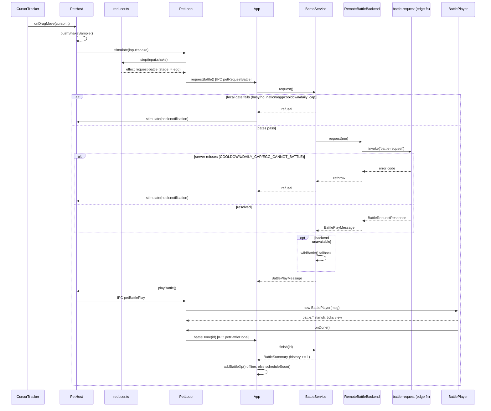

# Shake to battle

Grabbing the pet and shaking it is the only player-initiated path into a battle. This traces that
gesture from raw cursor samples to a `BattleSummary` in history. Battle math, matchmaking and reward
numbers are not restated here — see `docs/design/battle.md`.

## Detection: drag samples to shake verdict

While the pet is being dragged, `apps/desktop/src/main/input/CursorTracker.ts` polls the OS cursor
and streams positions into `apps/desktop/src/main/PetHost.ts:onDragMove`, which folds each `{t, x, y}`
sample into `packages/shared/src/input/shake.ts:pushShakeSample`. That function is pure and
stateless-in, stateless-out: it keeps a sliding window (`ShakeConfig.windowMs`), buckets the samples
into segments, picks the dominant axis (larger summed `|v|`), and counts sign reversals on that axis
among "fast" segments (`|v| >= minSpeed`). A `'shake'` verdict requires both enough reversals
(`minReversals`) and enough total travel (`minTravel`) on the dominant axis, and starts a
`cooldownMs` window before another `'shake'` can fire. A weaker `'shaking'` verdict (≥2 reversals)
fires earlier, purely to drive an in-progress wobble animation.

`onDragMove` turns the verdict into a stimulus: `'shaking'` → `input:shake-progress`, `'shake'` →
`input:shake` (`apps/desktop/src/main/PetHost.ts:onDragMove`).

## Reducer: gating on stage

`packages/shared/src/behavior/reducer.ts` handles both stimuli. `input:shake-progress` just nudges
the state machine toward `shaking` while dragged. `input:shake` always transitions state (even for an
egg, so the wobble still plays), but only pushes the `{type: 'request-battle'}` effect when
`model.stage !== 'egg'` — an egg shaking never reaches the IPC layer at all. This is the first of two
independent egg gates; the second is inside `BattleService` below, reachable only through the
`--dev-battle` CLI flag, which calls the battle path directly and skips the reducer.

## From effect to request, gates, and refusal

`apps/desktop/src/renderer/pet/loop.ts` (`PetLoop.step`) sees the `request-battle` effect and calls
`window.mons.requestBattle()`, which crosses into the main process as `IPC.petRequestBattle` and
lands in `apps/desktop/src/main/App.ts:onBattleRequest`, which calls
`apps/desktop/src/main/game/BattleService.ts:request`. That method checks gates in a
fixed order, short-circuiting on the first one that fails:

| Order | Gate | Refusal reason |
|---|---|---|
| 1 | a battle is already in flight (`this.pending`) | `busy` |
| 2 | no nation chosen yet | `no_nation` |
| 3 | `mySnapshot()` is null (no species, or stage is `egg`) | `egg` |
| 4 | `cooldownUntil()` is in the future | `cooldown` |
| 5 | `remainingToday()` is `0` | `daily_cap` |

Any refusal (`BattleOutcome` with `ok: false`) is shown the same way: `App.onBattleRequest` plays a
short "hurt" pose (`this.host.stimulate({ type: 'hook:notification' })`) so the player learns the
shake was understood but rejected, then pushes a fresh `UiSnapshot`.
`apps/desktop/src/renderer/panel/views/Battles.tsx` separately renders the live cooldown countdown
and `remainingToday` from that snapshot so the reason is visible without waiting for another shake.

## Resolution: server battle-request, or a wild fallback

Once past the local gates, `BattleService.request` asks the backend
(`apps/desktop/src/main/net/Backend.ts:request`), which invokes the
`supabase/functions/battle-request/index.ts` Edge Function. That function re-derives the same gates
server-side (`claim_battle_slot` RPC) and returns `COOLDOWN` / `DAILY_CAP` / `EGG_CANNOT_BATTLE` as
typed errors on the exact same conditions — the client cannot out-race its own cooldown by calling
the server directly. `RemoteBattleBackend` rethrows those three codes so `BattleService` turns them
into the same refusals as above; any other failure (offline, network error, unrecognized code) is
swallowed and treated as "no backend," and `BattleService.wildBattle` runs an offline battle against
a same-level Wild Mon from another nation instead. The server path picks a real opponent
(`findOpponent`, widening level windows) or its own wild-mon fallback when none is found — see
`docs/design/battle.md` for the opponent search and reward rules.

## Determinism guarantee

Either path ends in `simulateBattle(me, opponent, seed)` (`packages/shared/src/battle/battle.ts`),
seeded with the battle's own id — server-generated for a remote battle, `randomUUID()` client-side
for a wild fallback. Given the same two `MonSnapshot`s and the same seed, `simulateBattle` reproduces
the exact same turn-by-turn log on both client and server; nothing about playback (below) can change
the outcome, only how it is paced on screen. The RNG call order and cross-runtime determinism
guarantee are `docs/design/battle.md`'s to state.

## Playback: BattlePlayMessage to BattlePlayer

A successful `BattleOutcome` (`{ok: true, play}`) is stashed as `BattleService.pending` and handed to
`PetHost.playBattle`, which sends `IPC.petBattlePlay` to the pet renderer. `PetLoop.playBattle`
constructs a `BattlePlayer` (`apps/desktop/src/renderer/pet/BattlePlayer.ts`), which turns the
already-resolved `BattleResult.turns` into a time-based schedule — robust to dropped frames because
every step carries an absolute `at` (ms since playback start) rather than being driven frame-by-frame:

| Phase | Duration | Constant |
|---|---|---|
| Intro (opponent slides in, banner shows challenge) | 1200 ms | `INTRO_MS` |
| Per action (attack pose, banner updates) | 700 ms | `ACTION_MS` |
| Hit delay (damage/miss popup, hp bar update) | 260 ms after the action starts | `HIT_DELAY_MS` |
| Outro (win/lose banner holds, then cleanup) | 2600 ms after the last action | `OUTRO_MS` |
| Damage/miss popup lifetime | 900 ms | `POPUP_MS` |

While ticking, `BattlePlayer` emits `battle:play` / `battle:attack` / `battle:hit` / `battle:win` /
`battle:lose` / `battle:done` stimuli back through the same reducer so the pet's own sprite pose
tracks the fight, and updates its own `BattleView` (hp, popups, banner) that
`PetRenderer.drawBattle` reads directly — the view is mutated in place, not pushed through the
reducer.

## battle-done: history and XP

When the schedule reaches `endAt`, `BattlePlayer` emits `battle:done` and calls `onDone()`, which is
`window.mons.battleDone(id)` — `IPC.petBattleDone` — landing in `App.onBattleDone`. That calls
`BattleService.finish(id)`, which clears `pending` (only if the id matches — a stale or duplicate
call is a no-op) and unshifts a `BattleSummary` onto `battles.history`, capped at 50 entries. XP
crediting then forks on whether this app instance has a backend:

- **Online** (`this.api` set): the Edge Function already credited XP as part of resolving the battle,
  so `App.onBattleDone` only calls `this.sync?.scheduleSoon()` — the next `ingest-xp` sync
  reconciles `progress.serverXp`/`localXp` as usual (`docs/design/economy.md`).
- **Offline** (`CLAUDE_MONS_OFFLINE=1` or no backend configured): there is no server credit to
  reconcile, so `GameService.addBattleXp(summary.xp)` applies the reward locally, immediately.

Either way `App.onBattleDone` finishes with `pushSnapshot()`, and
`apps/desktop/src/renderer/panel/views/Battles.tsx` renders the new history row: win/loss, opponent
nickname and nation badge, species/level/turns/reason, a `wild` tag when `isBot`, and the XP reward.

## Sequence

