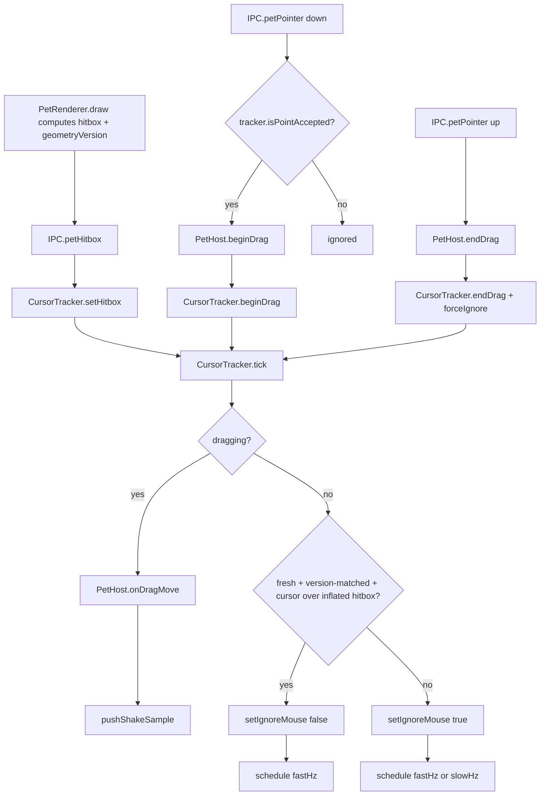

# Input and gestures

How a click reaches the pet and nothing else: the fail-closed click-through decision, and how
pointer events become a drag, a shake, a right-click menu or a hover card. The window those events
land in — its modes, bounds and display handling — is `docs/architecture/overlay-window.md`. For the
pet's state machine (idle/walk/dragged/falling/battle_*) see `docs/design/behavior-engine.md`.

## Fail-closed click-through

The renderer reports its opaque sprite bounding box; the main process polls the OS cursor and
decides whether the window should ignore mouse events. Nothing relies on Electron's `forward`
click-through mode, so behavior is identical on Windows and Linux. The design is fail-closed at
every layer (see [ADR 0018](../decisions/0018-compact-window-and-fail-closed-click-through.md) for
the bug this replaced: a stuck-open click-through state on the old full-width strip window let any
click along the bottom of the screen reach the pet):

- `CursorTracker` defaults to `setIgnoreMouseEvents(true)` from the moment it's constructed, before
  any tick has run.
- **Every tick re-derives the decision from scratch and re-asserts it unconditionally** — the
  `hovering` flag is only ever a record of the last decision (for the edge-triggered
  `onHoverChange`/hover-card event), never an input to the next tick's decision. A wrong state
  therefore self-heals within one poll interval instead of requiring "Bring pet back."
- Accepting input (`over`) requires **all** of: the cursor inside the window's current bounds; a
  cursor sample taken within the last `cursorFreshMs` (250 ms); a hitbox report received within the
  last `hitboxFreshMs` (500 ms) **and** tagged with the window's *current* `geometryVersion` (see
  below); the cursor inside that hitbox inflated by `inflate` DIPs (3). Any one of those being
  missing, stale, or mismatched forces click-through closed.
- Any exception anywhere in a tick forces click-through closed (`catch` around the whole tick body)
  rather than preserving whatever the last (possibly wrong) state was.
- `CursorTracker.forceIgnore()` immediately closes click-through and discards the current hitbox
  (rather than waiting for the next tick to notice staleness). `PetHost` calls it on `blur`, `hide`,
  and every mode switch / display change (`playBattle`, the `pet:battle-done` handler,
  `recenterOnPrimary`, `onLanded`, `endDrag`, the display-change `reanchor` handler).

Renderer/main wiring:

- Renderer: `apps/desktop/src/renderer/pet/loop.ts:PetLoop` calls `window.mons.sendHitbox` whenever
  `PetRenderer.hitboxChanged` reports a change, carrying a window-local `Hitbox` (`{x,y,w,h}` or
  `null`) plus the `geometryVersion` `PetRenderer` currently has (`PetRenderer.getGeometryVersion()`).
- Main: `PetHost.registerIpc` receives `IPC.petHitbox` (payload type `HitboxMessage`) and forwards
  it to `CursorTracker.setHitbox`.
- `CursorTracker.tick` (not dragging) computes `over` via `isPointAccepted`, which applies the
  freshness/version/inflate rules above using `apps/desktop/src/main/display.ts:pointInRect`, and
  calls `win.setIgnoreMouse(!over)` every tick (see above), firing `onHoverChange` only on change.
- Poll rate switches between `fastHz` (60 Hz) while the cursor is inside the window bounds and
  `slowHz` (12 Hz) otherwise — both defined in `CursorTracker`'s `DEFAULTS`.
- While a drag is active (`beginDrag`/`endDrag`), the tracker always polls at `fastHz` and never
  re-evaluates hover; mouse events stay enabled (`setIgnoreMouse(false)`) for the whole drag.

### Geometry versions

`PetWindow` keeps a `geometryVersion` counter, bumped on every successful `setBounds`/`setPosition`
(every hop, mode switch, or resize) and echoed to the renderer via `WindowGeometry.geometryVersion`.
The renderer stamps every hitbox report with the version it had in hand when it computed that
hitbox (`HitboxMessage.geometryVersion`); `CursorTracker` discards a hitbox whose version doesn't
match `PetWindow.getGeometryVersion()`'s *current* value, rather than trusting window-local
coordinates that may no longer correspond to the window's actual bounds (the root cause of "the
hitbox is nowhere near the sprite": the window had moved/resized since the renderer computed that
hitbox, and nothing detected the mismatch).

Hitbox coordinates stay window-local rather than screen-space — the simpler of the two options
(the renderer would otherwise need to track its own window position for no other reason); the
version tag is what makes window-local coordinates safe to trust only when they're known-current.

### Debug overlay and assertion

Under `CLAUDE_MONS_DEBUG=1`, `PetRenderer.drawDebug` draws the last reported hitbox as a red
rectangle directly on the canvas (in the same window-local coordinates used for the click-through
decision), and `PetHost.assertHitboxWithinWindow` warns when a reported hitbox falls outside the
window's own current bounds — the general shape of "something drawn where the window doesn't
cover." A stale-but-still-in-flight hitbox can trip this transiently right after a hop (expected,
self-corrects on the next renderer frame); a *sustained* warning means geometry has actually
diverged.

Unit-tested in `apps/desktop/test/CursorTracker.test.ts`: hover on/off, re-assertion every tick
(not only on change), inflate tolerance, no-hitbox-never-hovers, a hitbox tagged with a stale
geometry version discarded, a stale hitbox report discarded, `forceIgnore`, an exception during a
tick forcing click-through closed, drag streaming with hover suppressed, `isPointAccepted` (fresh/
stale cursor, stale version), and poll-rate switching.

## Pointer handling

A pointer event only ever reaches the renderer while the window isn't ignoring mouse events — but
that decision can have flipped in the instant between the tracker's last tick and the OS actually
delivering the click (or, in the bug this guards against, been wrong to begin with).
`PetHost.onPointer` re-checks `CursorTracker.isPointAccepted` before acting on a `down` (drag start)
or `contextmenu`/right-`down` (tray popup) that isn't already part of an active drag: left-click
only begins a drag (and, via the click/drag distinction below, only then can toggle the panel), and
right-click only opens the menu, if the tracker's own computed state agreed the point was over the
sprite. A release/context-menu that arrives *during* an already-validated drag is trusted
unconditionally (the drag's own grab already passed this check).

## Drag lifecycle

1. `IPC.petPointer` `down` (button 0), once `isPointAccepted` passes → `PetHost.beginDrag`: records
   `anchorAtGrab`/`cursorAtGrab`/`startedAt`, resets the shake detector, hides the hover card, and
   calls `PetWindow.enterMotion()` — switching to the motion arena (see "Motion mode" in `docs/architecture/overlay-window.md`), sized
   once to the current display's full work area — then `CursorTracker.beginDrag()`. Emits stimulus
   `input:grab`.
2. While dragging, `CursorTracker.tick` streams cursor positions to `PetHost.onDragMove`, which no
   longer repositions the window at all: the reducer's `input:drag` handler moves the model's `pos`
   directly (cursor offset by the grab delta), and the sprite just moves within the stationary
   motion-mode canvas. `onDragMove` only touches the window if `displayContaining(cursor)` differs
   from the display it last knew about, in which case it calls `window.setDisplay(target)` +
   `window.retargetMotion()` (one `setBounds`) before emitting `input:drag` and feeding the sample
   to the shake detector (below).
3. `IPC.petPointer` `up` → `PetHost.endDrag`: a press under
   `apps/desktop/src/main/PetHost.ts:CLICK_MAX_MS` (300 ms) that moved less than
   `CLICK_MAX_DIST` (6 DIPs) counts as a click, not a drag, and fires `onClick` (opens the tray/panel
   path). The drop point re-checks which display the cursor ended on (same
   `displayContaining`-based retarget as step 2, a harmless no-op duplicate in the common case);
   emits `input:release`. `CursorTracker.forceIgnore()` is called immediately after `endDrag`, ahead
   of the next tick. The window is still in `motion` mode at this point — nothing shrinks it back
   yet.
4. The shared reducer (`docs/design/behavior-engine.md`) drives the actual `dragged` → `falling` →
   `idle` state transitions from these stimuli, moving the model's `pos` every step while the window
   itself stays put; when it reaches the ground (or the release never left the ground to begin with)
   it emits effect `{ type: 'landed' }`, which the renderer turns into `window.mons.landed()` →
   `IPC.petLanded` → `PetHost.onLanded()`, which re-anchors the window to the (possibly new) display
   and calls `PetWindow.enterFollow(anchor)` to compute compact bounds around the landing point and
   switch back out of motion mode with one more `setBounds`. `PetLoop.step()`
   (`apps/desktop/src/renderer/pet/loop.ts`) sends this frame's `pet:state` message *before*
   dispatching the `landed` effect (not after, as for every other frame), so `PetHost.lastState`
   already carries the true landed position by the time `onLanded` reads it via `currentAnchor()` —
   otherwise `onLanded` would anchor the compact window around the second-to-last (still slightly
   airborne) position and need an immediate corrective `followTo` hop once the fresher state message
   arrived, an extra `setBounds` beyond the one this section promises.

Every `IPC.petState` message while in `follow` mode calls `PetWindow.followTo`, threshold-gated
(`needsHop`) so an ordinary walk only hops occasionally; `followTo` is a no-op outside `follow` mode
(`canHopFollow`), which is exactly the case for the whole dragged/falling stretch now that it lives
in `motion` mode instead.

## Shake detector

Pure, in `packages/shared/src/input/shake.ts`; fed `(t, x, y)` samples via
`pushShakeSample` while dragging. It keeps a sliding window of samples, computes per-segment
velocity, picks the axis (`horizontal`/vertical) with the larger summed absolute velocity, and
counts sign reversals between consecutive segments that both exceed `minSpeed`.

Constants, all in `DEFAULT_SHAKE_CONFIG` (`packages/shared/src/input/shake.ts`) unless noted:

| Constant | Value | Meaning |
|---|---|---|
| `windowMs` | 1000 | sliding sample window |
| `minSpeed` | 900 DIP/s | a segment counts as "fast" at or above this |
| `minReversals` | 4 | fast-segment sign reversals needed for verdict `'shake'` |
| `minTravel` | 250 DIP | total travel on the dominant axis needed for `'shake'` |
| `cooldownMs` | 3000 | no second `'shake'` verdict for this long after one fires |
| `MIN_SEGMENT_MS` | 4 | segments shorter than this (duplicate/coalesced pointer events) are dropped |

Verdict `'shaking'` fires once `reversals >= 2` (below the full threshold) and drives stimulus
`input:shake-progress`; a full `'shake'` verdict (also past `cooldownUntil`) drives `input:shake` and
resets the sample window. `PetHost.onDragMove` pushes samples and maps verdicts to these stimuli;
the reducer turns `input:shake` into effect `{ type: 'request-battle' }` for non-egg stages.

## Hover → hover card

`PetHost`'s `onHoverChange` callback (from `CursorTracker`) calls back into
`apps/desktop/src/main/App.ts`, which schedules or hides the hover card:
`apps/desktop/src/main/App.ts:HOVER_DELAY_MS` (1000 ms) after hover starts,
`HoverCardWindow.scheduleShow(anchor, HOVER_DELAY_MS)` fires; hover ending before the delay calls
`HoverCardWindow.cancel()` via `hide()`. The anchor passed is `PetHost.spriteAnchorInfo()`: the
current drag/idle anchor plus `spriteTop` (top of the sprite in world DIPs, from the last reported
hitbox).

`apps/desktop/src/main/windows/HoverCardWindow.ts` is a 240×92 frameless, transparent,
non-focusable, click-through, always-on-top window, created lazily and reused. `showAt` picks the
display nearest the anchor, clamps `x` to the display's work area (4 px margin each side), and
places `y` above `spriteTop` with a 12 px gap; if that would go off the top of the work area it
flips to 12 px below the anchor instead.

## Test coverage

| Area | Coverage |
|---|---|
| `CursorTracker` (fail-closed default, re-assertion every tick, hitbox/cursor freshness, geometry-version mismatch discarded, `forceIgnore`, exception-forces-closed, `isPointAccepted`, drag streaming, poll-rate switching, non-finite cursor sample dropped) | Unit-tested, `apps/desktop/test/CursorTracker.test.ts` |
| Shake detector | Unit-tested in `packages/shared` (see that package's tests, not duplicated here) |
| `PetHost.onPointer`, the drag lifecycle and hover-card timing | No automated test — Electron-coupled; verified manually on Windows (see [ADR 0018](../decisions/0018-compact-window-and-fail-closed-click-through.md)) |

Window geometry coverage is listed in `docs/architecture/overlay-window.md`.
