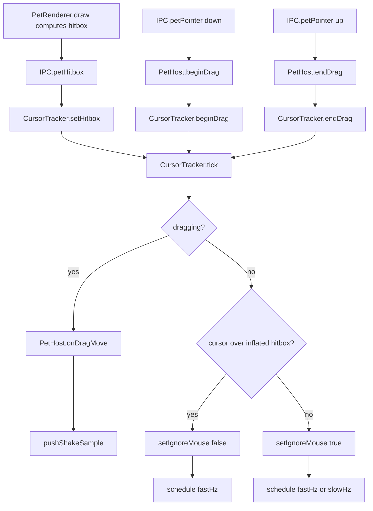

# Overlay window and input

How the pet lives on screen: one always-on-top transparent window per pet, how clicks pass through
it except over the sprite, and how drag/shake/hover gestures are detected. For the wider process
model and IPC channel list see `apps/desktop/README.md` and `apps/desktop/IPC.md`. For the pet's
state machine (idle/walk/dragged/falling/battle_*) see `docs/design/behavior-engine.md`.

## One window, two modes

`apps/desktop/src/main/windows/PetWindow.ts` owns a single `BrowserWindow` per pet; there is no
separate window per mode. `PetHost` moves and resizes it between two bounds:

- **strip** — spans the full work-area width along the bottom edge; the pet walks inside it and
  the window itself never moves, so there are no hop glitches and hit-testing stays trivial.
- **follow** — an `apps/desktop/src/main/windows/PetWindow.ts:FOLLOW_SIZE_GRID`-square window that
  `PetHost` repositions every frame while the pet is dragged or falling, so it can leave the strip.

Bounds math for both lives in `apps/desktop/src/main/display.ts:stripBounds` and
`apps/desktop/src/main/display.ts:followBounds`. `apps/desktop/src/main/windows/PetWindow.ts:STRIP_HEIGHT_GRID`
(80 grid px) sets strip height before `spriteScale`; `FOLLOW_SIZE_GRID` (80) sets the follow square side.

Window flags, all set in the `PetWindow` constructor unless noted:

| Flag | Value | Note |
|---|---|---|
| `transparent` | `true` | |
| `frame` | `false` | |
| `alwaysOnTop` | `true` | re-set via `setAlwaysOnTop(true, 'screen-saver')`; re-asserted every 5 s on win32 (other topmost windows can cover it) |
| `skipTaskbar` | `true` | |
| `resizable` / `movable` | `false` | bounds are only ever changed programmatically |
| `minimizable` / `maximizable` / `fullscreenable` | `false` | |
| `hasShadow` | `false` | |
| `focusable` | `opts.focusable` (`process.platform !== 'linux'`) | some Linux WMs break always-on-top for unfocusable windows |
| `type` | `'toolbar'` on Linux only | |
| `setVisibleOnAllWorkspaces` | `true`, `{ visibleOnFullScreen: true }` | |
| `setIgnoreMouseEvents` | `true` by default | flipped per-frame, see below |
| `webPreferences.sandbox` / `contextIsolation` | `true` | shared preload, see `apps/desktop/IPC.md` |
| `webPreferences.backgroundThrottling` | `false` | keeps the rAF loop running while occluded |

## Click-through decision

The renderer reports its opaque sprite bounding box; the main process polls the OS cursor and
decides whether the window should ignore mouse events. Nothing relies on Electron's `forward`
click-through mode, so behavior is identical on Windows and Linux.

- Renderer: `apps/desktop/src/renderer/pet/loop.ts:PetLoop` calls `window.mons.sendHitbox` whenever
  `PetRenderer.hitboxChanged` reports a change, carrying a window-local `Hitbox` (`{x,y,w,h}` or
  `null`).
- Main: `PetHost.registerIpc` receives `IPC.petHitbox` and forwards it to
  `apps/desktop/src/main/input/CursorTracker.ts:setHitbox`.
- `CursorTracker.tick` (not dragging) reads `screen.getCursorScreenPoint()`, checks it's inside the
  window bounds and inside the hitbox inflated by `inflate` DIPs
  (`apps/desktop/src/main/display.ts:pointInRect`), and calls `win.setIgnoreMouse(!over)` only on a
  change, firing `onHoverChange`.
- Poll rate switches between `fastHz` (60 Hz) while the cursor is inside the window bounds and
  `slowHz` (12 Hz) otherwise — both defined in `apps/desktop/src/main/input/CursorTracker.ts`'s
  `DEFAULTS`. `inflate` is 3 DIPs,
  giving the sprite edge some grab tolerance.
- While a drag is active (`beginDrag`/`endDrag`), the tracker always polls at `fastHz` and never
  re-evaluates hover; mouse events stay enabled (`setIgnoreMouse(false)`) for the whole drag.

Unit-tested in `apps/desktop/test/CursorTracker.test.ts` with an injected `TrackedWindow`/cursor
source: hover on/off, inflate tolerance, no-hitbox-never-hovers, drag streaming with hover
suppressed, and poll-rate switching.

## Drag lifecycle

1. `IPC.petPointer` `down` (button 0) → `PetHost.beginDrag`: records `anchorAtGrab`/`cursorAtGrab`/
   `startedAt`, resets the shake detector, hides the hover card, and calls
   `PetWindow.enterFollow(anchor)` — switching the window to follow bounds around the current
   anchor — then `CursorTracker.beginDrag()`. Emits stimulus `input:grab`.
2. While dragging, `CursorTracker.tick` streams cursor positions to `PetHost.onDragMove`, which
   computes the new anchor (cursor position offset by the grab delta), calls
   `PetWindow.followTo(anchor)` to reposition the window, emits `input:drag`, and feeds the sample
   to the shake detector (below).
3. `IPC.petPointer` `up` → `PetHost.endDrag`: a press under
   `apps/desktop/src/main/PetHost.ts:CLICK_MAX_MS` (300 ms) that moved less than
   `CLICK_MAX_DIST` (6 DIPs) counts as a click, not a drag, and fires `onClick` (opens the tray/panel
   path). Otherwise the drop point decides which display the pet falls toward
   (`apps/desktop/src/main/display.ts:displayContaining`); emits `input:release`.
4. The shared reducer (`docs/design/behavior-engine.md`) drives the actual `dragged` → `falling` →
   `idle` state transitions from these stimuli; when it reaches the ground it emits effect
   `{ type: 'landed' }`, which the renderer turns into `window.mons.landed()` →
   `IPC.petLanded` → `PetHost.onLanded()`, which re-anchors the window to the (possibly new)
   display and switches it back to `enterStrip()`.

## Shake detector

Pure, in `packages/shared/src/input/shake.ts`; fed `(t, x, y)` samples via
`pushShakeSample` while dragging. It keeps a sliding window of samples, computes per-segment
velocity, picks the axis (`horizontal`/vertical) with the larger summed absolute velocity, and
counts sign reversals between consecutive segments that both exceed `minSpeed`.

Constants, all in `DEFAULT_SHAKE_CONFIG` (`packages/shared/src/input/shake.ts`) unless noted:

| Constant | Value | Meaning |
|---|---|---|
| `windowMs` | 1000 | sliding sample window |
| `minSpeed` | 900 DIP/s | a segment counts as "fast" at or above this |
| `minReversals` | 4 | fast-segment sign reversals needed for verdict `'shake'` |
| `minTravel` | 250 DIP | total travel on the dominant axis needed for `'shake'` |
| `cooldownMs` | 3000 | no second `'shake'` verdict for this long after one fires |
| `MIN_SEGMENT_MS` | 4 | segments shorter than this (duplicate/coalesced pointer events) are dropped |

Verdict `'shaking'` fires once `reversals >= 2` (below the full threshold) and drives stimulus
`input:shake-progress`; a full `'shake'` verdict (also past `cooldownUntil`) drives `input:shake` and
resets the sample window. `PetHost.onDragMove` pushes samples and maps verdicts to these stimuli;
the reducer turns `input:shake` into effect `{ type: 'request-battle' }` for non-egg stages.

## Hover → hover card

`PetHost`'s `onHoverChange` callback (from `CursorTracker`) calls back into
`apps/desktop/src/main/App.ts`, which schedules
or hides the hover card: `apps/desktop/src/main/App.ts:HOVER_DELAY_MS` (1000 ms) after hover starts,
`HoverCardWindow.scheduleShow(anchor, HOVER_DELAY_MS)` fires; hover ending before the delay calls
`HoverCardWindow.cancel()` via `hide()`. The anchor passed is `PetHost.spriteAnchorInfo()`: the
current drag/idle anchor plus `spriteTop` (top of the sprite in world DIPs, from the last reported
hitbox).

`apps/desktop/src/main/windows/HoverCardWindow.ts` is a 240×92 frameless, transparent,
non-focusable, click-through, always-on-top window, created lazily and reused. `showAt` picks the
display nearest the anchor, clamps `x` to the display's work area (4 px margin each side), and
places `y` above `spriteTop` with a 12 px gap; if that would go off the top of the work area it
flips to 12 px below the anchor instead.

## World bounds, ground line, anchor memory

`apps/desktop/src/main/display.ts:worldForDisplay` derives the shared `World` (`minX`, `maxX`,
`groundY`) from a display's `workArea`: `groundY` is the top edge of the work area (so the pet
stands on top of the taskbar/dock), and `minX`/`maxX` keep the sprite's center at least
`apps/desktop/src/main/display.ts:EDGE_MARGIN` (24 DIPs) plus half the sprite width from either
edge. `PetHost.world()` recomputes this whenever sprite scale, stage, or display changes and pushes
it via `IPC.petWorld` plus stimulus `world:bounds`.

Position across restarts and resolution changes is remembered as a fraction, not a pixel: `AnchorMemory`
(`{ displayId, fractionX }`) is produced by `rememberAnchor` and turned back into an absolute `x` by
`restoreAnchorX`, so a saved position survives a display being resized or swapped for one of a
different width.

## Multi-monitor handling

`PetHost.registerDisplayEvents` listens to Electron's `display-added`, `display-removed`, and
`display-metrics-changed`; on any of them it re-resolves the current display by id (falling back to
the primary display if it's gone), calls `PetWindow.setDisplay`, and pushes a fresh `World`. On drop
(`endDrag`), `displayContaining` picks the display whose bounds contain the cursor, defaulting to
the display the pet was already on if none match (e.g. a coordinate in the gap between two
displays). `PetHost.pickInitialDisplay` prefers the display named in the persisted `AnchorMemory`,
falling back to `screen.getPrimaryDisplay()`.

## Linux specifics

`apps/desktop/src/main/index.ts` appends the `enable-transparent-visuals` Chromium switch before
`app.whenReady()` on Linux (required for transparent windows under X11/XWayland) and, after
`ready`, waits 300 ms before creating any window — a workaround for a known Electron/Linux race
where a transparent window created immediately after `ready` renders as an opaque black square.
`PetWindow` and `HoverCardWindow` both set `focusable: false` → not applied (`PetWindow`'s
`focusable` is instead forced to `false` on Linux by `PetHost`'s constructor call) and
`type: 'toolbar'` only on Linux, since some window managers otherwise break always-on-top for
unfocusable windows. The native-Wayland limitation (XWayland required) is tracked in
`docs/ROADMAP.md`; this doc does not restate it.

## Test coverage

| Area | Coverage |
|---|---|
| `CursorTracker` (hover/click-through, drag streaming, poll-rate switching) | Unit-tested, `apps/desktop/test/CursorTracker.test.ts` |
| `apps/desktop/src/main/display.ts` (world bounds, strip/follow bounds, display lookup, anchor memory) | Unit-tested, `apps/desktop/test/display.test.ts` |
| Shake detector | Unit-tested in `packages/shared` (see that package's tests, not duplicated here) |
| `PetWindow`, `PetHost`, `HoverCardWindow` (actual window flags, always-on-top behavior, transparency) | No automated test — Electron-coupled; verified manually on Windows |
| Linux window flags, `enable-transparent-visuals`, the 300 ms boot delay, XWayland behavior | No automated test; not covered by the manual Windows verification either |
