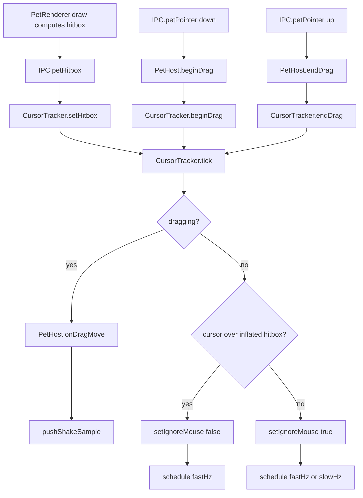

# Overlay window and input

How the pet lives on screen: one always-on-top transparent window per pet, how clicks pass through
it except over the sprite, and how drag/shake/hover gestures are detected. For the wider process
model and IPC channel list see `apps/desktop/README.md` and `apps/desktop/IPC.md`. For the pet's
state machine (idle/walk/dragged/falling/battle_*) see `docs/design/behavior-engine.md`.

## One window, three modes

`apps/desktop/src/main/windows/PetWindow.ts` owns a single `BrowserWindow` per pet; there is no
separate window per mode. `PetHost` moves and resizes it between three bounds:

- **strip** — spans the full work-area width along the bottom edge; the pet walks inside it and
  the window itself never moves, so there are no hop glitches and hit-testing stays trivial.
- **follow** — an `apps/desktop/src/main/windows/PetWindow.ts:FOLLOW_SIZE_GRID`-square window that
  `PetHost` repositions every frame while the pet is dragged or falling, so it can leave the strip.
- **battle** — a generously-sized box (`apps/desktop/src/main/windows/PetWindow.ts:BATTLE_WIDTH_GRID`/
  `BATTLE_HEIGHT_GRID`) entered by `PetHost.playBattle` and left again on `IPC.petBattleDone`, wide/tall
  enough to fit both mons, hp bars, popups and the banner without depending on banner text width — see
  `docs/architecture/flows/shake-to-battle.md` for the arena sizing and HUD-fitting details.

Bounds math lives in `apps/desktop/src/main/display.ts`: `stripBounds`, `followBounds`, and
`battleBounds` (which additionally clamps into the display's work area via `clampRectToArea`, so the
arena never has to hang off a small/secondary display). `apps/desktop/src/main/windows/PetWindow.ts:STRIP_HEIGHT_GRID`
(80 grid px) sets strip height before `spriteScale`; `FOLLOW_SIZE_GRID` (80) sets the follow square side.

Window flags, all set in the `PetWindow` constructor unless noted:

| Flag | Value | Note |
|---|---|---|
| `transparent` | `true` | |
| `frame` | `false` | |
| `alwaysOnTop` | `true` | re-set via `setAlwaysOnTop(true, 'screen-saver')`; re-asserted every 5 s on win32, and (with `moveTop()`) after every mode switch and on `show()` — see "Z-order re-assertion" below |
| `skipTaskbar` | `true` | |
| `resizable` / `movable` | `false` | bounds are only ever changed programmatically |
| `minimizable` / `maximizable` / `fullscreenable` | `false` | |
| `hasShadow` | `false` | |
| `focusable` | `opts.focusable` (`process.platform !== 'linux'`) | some Linux WMs break always-on-top for unfocusable windows |
| `type` | `'toolbar'` on Linux only | |
| `setVisibleOnAllWorkspaces` | `true`, `{ visibleOnFullScreen: true }` | |
| `setIgnoreMouseEvents` | `true` by default | flipped per-frame, see below |
| `webPreferences.sandbox` / `contextIsolation` | `true` | shared preload, see `apps/desktop/IPC.md` |
| `webPreferences.backgroundThrottling` | `false` | keeps the rAF loop running while occluded |

## Integer geometry only

`BrowserWindow.setBounds`/`setPosition`/`setSize` reject any non-integer or non-finite (`NaN`/
`Infinity`) coordinate with `TypeError: Error processing argument at index 0, conversion failure`,
which Electron then surfaces as an uncaught-exception crash dialog. A fractional or `NaN`
coordinate has reached these calls in the wild (observed while shaking an egg, which streams
`CursorTracker` samples at 60 Hz through drag math very quickly). Two independent guards close
this off:

- `apps/desktop/src/main/display.ts:toIntPoint` / `toIntRect` round to the nearest integer and
  return `null` when either input is non-finite. Every `setBounds`/`setPosition`/`setSize` call in
  `PetWindow` goes through the private `setBoundsSafe`/`setPositionSafe` wrappers, which call these
  helpers and skip the native call (logging under `CLAUDE_MONS_DEBUG=1`) instead of ever forwarding
  a bad value. `worldForDisplay`/`stripBounds` additionally round `display.workArea` itself before
  using it, since Electron has been observed to hand back fractional work-area values under
  fractional Windows DPI scaling (125%/150%/175%).
- `CursorTracker.tick` drops a single OS cursor sample outright when
  `screen.getCursorScreenPoint()` comes back non-finite, rather than feeding it into drag/anchor
  math (which would otherwise carry the bad value all the way to `PetWindow.followTo`). The next
  tick tries again; a dropped sample is invisible at 60 Hz.
- As a last line of defense, `apps/desktop/src/main/index.ts` installs `uncaughtException` and
  `unhandledRejection` handlers that log to console and append to `<userData>/crash.log` (capped
  at ~1 MB, oldest history dropped first) instead of letting Electron show its blocking modal and
  take the app down.

## Z-order re-assertion

A dropped pet has been observed ending up behind another always-on-top window (e.g. the Claude
desktop app) after a drag. `PetWindow.reassertTopmost()` (`setAlwaysOnTop(true, 'screen-saver')`
+ `moveTop()`) is called after every mode switch (`enterStrip`, `enterFollow`, `enterBattle`), on
`show()`, and every 5 s on win32 while visible — `moveTop()` matters because a non-focusable topmost
window (`focusable: false`) can still lose its place in the topmost z-order to another topmost
window; re-asserting the flag alone does not always restore ordering, `moveTop()` does.

> Live-tested on Windows 11: with a normal (non-topmost) window covering the taskbar area, an
> `EnumWindows` z-order dump taken mid-battle showed the pet window ahead of it. A battle HUD that
> still looks "behind" another window despite this is a clipping bug, not a z-order one — see the
> arena sizing note above and `docs/architecture/flows/shake-to-battle.md`.

## Geometry divergence: a debug assertion, and two bugs it caught live

`PetHost`'s `IPC.petHitbox` handler calls a debug-only (`CLAUDE_MONS_DEBUG=1`) `assertHitboxWithinWindow`
that warns when the renderer's reported hitbox (window-local) falls outside `win.getBounds()` — the
general shape of "something drawn where the window doesn't cover." Live-testing it caught two bugs:

- **Falling in `follow` mode never repositioned the window.** `followTo` was only ever called from
  `onDragMove`, which stops the moment the pointer is released; once a release started a real fall
  (`above` in the reducer's `input:release` handler), the follow window stayed put while the model kept
  falling inside it, so the sprite drifted past its bottom edge until landing. Fixed: `PetHost`'s
  `IPC.petState` handler now calls `followTo` on every reported position while in `follow` mode, not
  only during an active drag (a harmless duplicate of the drag-time call while dragging).
- **A renderer boot race.** The render loop starts as soon as `IPC.petConfig` arrives, but geometry is
  sent as a *separate* `IPC.petWindowMoved` message; a first frame drawn before that second message
  landed used `PetRenderer.geometry`'s `{0,0,0,0}` placeholder (observed on a run's very first hitbox).
  Fixed: `PetConfig` now carries `windowGeometry`, and `PetRenderer` seeds `geometry` from it directly.

## Click-through decision

The renderer reports its opaque sprite bounding box; the main process polls the OS cursor and
decides whether the window should ignore mouse events. Nothing relies on Electron's `forward`
click-through mode, so behavior is identical on Windows and Linux.

- Renderer: `apps/desktop/src/renderer/pet/loop.ts:PetLoop` calls `window.mons.sendHitbox` whenever
  `PetRenderer.hitboxChanged` reports a change, carrying a window-local `Hitbox` (`{x,y,w,h}` or
  `null`).
- Main: `PetHost.registerIpc` receives `IPC.petHitbox` and forwards it to
  `apps/desktop/src/main/input/CursorTracker.ts:setHitbox`.
- `CursorTracker.tick` (not dragging) reads `screen.getCursorScreenPoint()`, checks it's inside the
  window bounds and inside the hitbox inflated by `inflate` DIPs
  (`apps/desktop/src/main/display.ts:pointInRect`), and calls `win.setIgnoreMouse(!over)` only on a
  change, firing `onHoverChange`.
- Poll rate switches between `fastHz` (60 Hz) while the cursor is inside the window bounds and
  `slowHz` (12 Hz) otherwise — both defined in `apps/desktop/src/main/input/CursorTracker.ts`'s
  `DEFAULTS`. `inflate` is 3 DIPs,
  giving the sprite edge some grab tolerance.
- While a drag is active (`beginDrag`/`endDrag`), the tracker always polls at `fastHz` and never
  re-evaluates hover; mouse events stay enabled (`setIgnoreMouse(false)`) for the whole drag.

Unit-tested in `apps/desktop/test/CursorTracker.test.ts` with an injected `TrackedWindow`/cursor
source: hover on/off, inflate tolerance, no-hitbox-never-hovers, drag streaming with hover
suppressed, and poll-rate switching.

## Drag lifecycle

1. `IPC.petPointer` `down` (button 0) → `PetHost.beginDrag`: records `anchorAtGrab`/`cursorAtGrab`/
   `startedAt`, resets the shake detector, hides the hover card, and calls
   `PetWindow.enterFollow(anchor)` — switching the window to follow bounds around the current
   anchor — then `CursorTracker.beginDrag()`. Emits stimulus `input:grab`.
2. While dragging, `CursorTracker.tick` streams cursor positions to `PetHost.onDragMove`, which
   computes the new anchor (cursor position offset by the grab delta), calls
   `PetWindow.followTo(anchor)` to reposition the window, emits `input:drag`, and feeds the sample
   to the shake detector (below). `followTo` only ever repositions (`setPosition`, never resizes)
   and broadcasts the new `IPC.petWindowMoved` geometry synchronously from the bounds it just
   commanded, rather than waiting for the native `'move'` event: that event can lag a frame behind
   the actual OS move, during which the renderer would otherwise paint the sprite against the
   previous frame's window origin while the window itself has already moved — a one-frame
   offset/flicker. `enterFollow`/`enterStrip` never call `show()`/`hide()`, so a mode switch is
   always a same-window resize in place.
3. `IPC.petPointer` `up` → `PetHost.endDrag`: a press under
   `apps/desktop/src/main/PetHost.ts:CLICK_MAX_MS` (300 ms) that moved less than
   `CLICK_MAX_DIST` (6 DIPs) counts as a click, not a drag, and fires `onClick` (opens the tray/panel
   path). Otherwise the drop point decides which display the pet falls toward
   (`apps/desktop/src/main/display.ts:displayContaining`); emits `input:release`.
4. The shared reducer (`docs/design/behavior-engine.md`) drives the actual `dragged` → `falling` →
   `idle` state transitions from these stimuli; when it reaches the ground it emits effect
   `{ type: 'landed' }`, which the renderer turns into `window.mons.landed()` →
   `IPC.petLanded` → `PetHost.onLanded()`, which re-anchors the window to the (possibly new)
   display and switches it back to `enterStrip()`.

## Shake detector

Pure, in `packages/shared/src/input/shake.ts`; fed `(t, x, y)` samples via
`pushShakeSample` while dragging. It keeps a sliding window of samples, computes per-segment
velocity, picks the axis (`horizontal`/vertical) with the larger summed absolute velocity, and
counts sign reversals between consecutive segments that both exceed `minSpeed`.

Constants, all in `DEFAULT_SHAKE_CONFIG` (`packages/shared/src/input/shake.ts`) unless noted:

| Constant | Value | Meaning |
|---|---|---|
| `windowMs` | 1000 | sliding sample window |
| `minSpeed` | 900 DIP/s | a segment counts as "fast" at or above this |
| `minReversals` | 4 | fast-segment sign reversals needed for verdict `'shake'` |
| `minTravel` | 250 DIP | total travel on the dominant axis needed for `'shake'` |
| `cooldownMs` | 3000 | no second `'shake'` verdict for this long after one fires |
| `MIN_SEGMENT_MS` | 4 | segments shorter than this (duplicate/coalesced pointer events) are dropped |

Verdict `'shaking'` fires once `reversals >= 2` (below the full threshold) and drives stimulus
`input:shake-progress`; a full `'shake'` verdict (also past `cooldownUntil`) drives `input:shake` and
resets the sample window. `PetHost.onDragMove` pushes samples and maps verdicts to these stimuli;
the reducer turns `input:shake` into effect `{ type: 'request-battle' }` for non-egg stages.

## Hover → hover card

`PetHost`'s `onHoverChange` callback (from `CursorTracker`) calls back into
`apps/desktop/src/main/App.ts`, which schedules
or hides the hover card: `apps/desktop/src/main/App.ts:HOVER_DELAY_MS` (1000 ms) after hover starts,
`HoverCardWindow.scheduleShow(anchor, HOVER_DELAY_MS)` fires; hover ending before the delay calls
`HoverCardWindow.cancel()` via `hide()`. The anchor passed is `PetHost.spriteAnchorInfo()`: the
current drag/idle anchor plus `spriteTop` (top of the sprite in world DIPs, from the last reported
hitbox).

`apps/desktop/src/main/windows/HoverCardWindow.ts` is a 240×92 frameless, transparent,
non-focusable, click-through, always-on-top window, created lazily and reused. `showAt` picks the
display nearest the anchor, clamps `x` to the display's work area (4 px margin each side), and
places `y` above `spriteTop` with a 12 px gap; if that would go off the top of the work area it
flips to 12 px below the anchor instead.

## World bounds, ground line, anchor memory

`apps/desktop/src/main/display.ts:worldForDisplay` derives the shared `World` (`minX`, `maxX`,
`groundY`) from a display's `workArea`: `groundY` is the top edge of the work area (so the pet
stands on top of the taskbar/dock), and `minX`/`maxX` keep the sprite's center at least
`apps/desktop/src/main/display.ts:EDGE_MARGIN` (24 DIPs) plus half the sprite width from either
edge. `PetHost.world()` recomputes this whenever sprite scale, stage, or display changes and pushes
it via `IPC.petWorld` plus stimulus `world:bounds`. The reducer's `world:bounds` handler
(`packages/shared/src/behavior/reducer.ts`) clamps `pos.x` into the new `[minX, maxX]` and pulls
`pos.y` up to the new `groundY` while airborne on every such update, so a display/scale change
mid-walk or mid-fall cannot leave the pet outside the new bounds.

If the pet still ends up stuck or off-screen (e.g. a missed edge case in the above), "Bring pet
back" in the tray/context menu (`apps/desktop/src/main/tray/Tray.ts`) calls
`PetHost.recenterOnPrimary()`: re-anchors the window to the primary display, forces it back to
`enterStrip()` regardless of the current mode, and sends stimulus `world:recenter`, which snaps
the model to the center of the (new) world, on the ground, cancelling any drag/fall/walk in
progress (left alone mid-battle, so it doesn't derail an in-progress battle animation).

Position across restarts and resolution changes is remembered as a fraction, not a pixel: `AnchorMemory`
(`{ displayId, fractionX }`) is produced by `rememberAnchor` and turned back into an absolute `x` by
`restoreAnchorX`, so a saved position survives a display being resized or swapped for one of a
different width.

## Multi-monitor handling

`PetHost.registerDisplayEvents` listens to Electron's `display-added`, `display-removed`, and
`display-metrics-changed`; on any of them it re-resolves the current display by id (falling back to
the primary display if it's gone), calls `PetWindow.setDisplay`, and pushes a fresh `World`. On drop
(`endDrag`), `displayContaining` picks the display whose bounds contain the cursor, defaulting to
the display the pet was already on if none match (e.g. a coordinate in the gap between two
displays). `PetHost.pickInitialDisplay` prefers the display named in the persisted `AnchorMemory`,
falling back to `screen.getPrimaryDisplay()`.

## Linux specifics

`apps/desktop/src/main/index.ts` appends the `enable-transparent-visuals` Chromium switch before
`app.whenReady()` on Linux (required for transparent windows under X11/XWayland) and, after
`ready`, waits 300 ms before creating any window — a workaround for a known Electron/Linux race
where a transparent window created immediately after `ready` renders as an opaque black square.
`PetWindow` and `HoverCardWindow` both set `focusable: false` → not applied (`PetWindow`'s
`focusable` is instead forced to `false` on Linux by `PetHost`'s constructor call) and
`type: 'toolbar'` only on Linux, since some window managers otherwise break always-on-top for
unfocusable windows. The native-Wayland limitation (XWayland required) is tracked in
`docs/ROADMAP.md`; this doc does not restate it.

## Test coverage

| Area | Coverage |
|---|---|
| `CursorTracker` (hover/click-through, drag streaming, poll-rate switching, non-finite cursor sample dropped) | Unit-tested, `apps/desktop/test/CursorTracker.test.ts` |
| `apps/desktop/src/main/display.ts` (world bounds, strip/follow/battle bounds, `clampRectToArea`, display lookup, anchor memory, `toIntPoint`/`toIntRect`, fractional-work-area rounding) | Unit-tested, `apps/desktop/test/display.test.ts` |
| Banner wrap/shrink/truncate and HUD-clamp helpers (`apps/desktop/src/renderer/pet/bannerFit.ts`) | Unit-tested, `apps/desktop/test/bannerFit.test.ts` |
| Shake detector | Unit-tested in `packages/shared` (see that package's tests, not duplicated here) |
| Reducer `world:bounds` clamp and `world:recenter` recovery | Unit-tested, `packages/shared/test/behavior.test.ts` |
| `PetWindow`, `PetHost`, `HoverCardWindow` (actual window flags, always-on-top/z-order behavior, transparency, crash-log handlers, battle arena mode switch) | No automated test — Electron-coupled; verified manually on Windows (see the z-order/clipping note above) |
| Linux window flags, `enable-transparent-visuals`, the 300 ms boot delay, XWayland behavior | No automated test; not covered by the manual Windows verification either |
