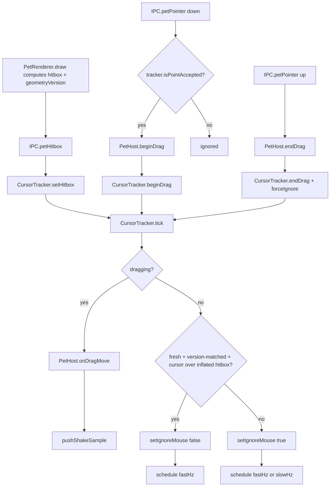

# Overlay window and input

How the pet lives on screen: one always-on-top transparent window per pet, how clicks pass through
it except over the sprite, and how drag/shake/hover gestures are detected. For the wider process
model and IPC channel list see `apps/desktop/README.md` and `apps/desktop/IPC.md`. For the pet's
state machine (idle/walk/dragged/falling/battle_*) see `docs/design/behavior-engine.md`.

## One window, always compact

`apps/desktop/src/main/windows/PetWindow.ts` owns a single `BrowserWindow` per pet; there is no
separate window per mode. `PetHost` moves and resizes it between three bounds:

- **follow** — the one normal mode, always present outside a drag/fall/battle. A compact rect about
  3 sprite-widths by 2.5 sprite-heights (`PetWindow.COMPACT_WIDTH_GRID`/`COMPACT_HEIGHT_GRID`, grid
  px scaled by sprite scale), positioned so the sprite's anchor sits inside it. The sprite moves
  smoothly within the canvas as the pet walks; `PetHost` only *hops* the window (`PetWindow.followTo`,
  a reposition) once the sprite drifts more than 1/3 of the window's width from its center
  (`apps/desktop/src/main/display.ts:needsHop`), or immediately on an ordinary display change
  (`force: true`). See [ADR 0018](../decisions/0018-compact-window-and-fail-closed-click-through.md)
  for why this replaced an earlier full-work-area-width "strip" window.
- **motion** — entered for the whole of a drag through landing; see "Motion mode" below.
- **battle** — a generously-sized box (`BATTLE_WIDTH_GRID`/`BATTLE_HEIGHT_GRID`) entered by
  `PetHost.playBattle` and left again on `IPC.petBattleDone` (back to `follow`), wide/tall enough
  to fit both mons, hp bars, popups and the banner without depending on banner text width — see
  `docs/architecture/flows/shake-to-battle.md` for the arena sizing and HUD-fitting details.

Bounds math lives in `apps/desktop/src/main/display.ts`: `compactBounds`, `motionBounds` and
`battleBounds` all clamp into the display's work area via `clampRectToArea`, so no window ever has
to hang off a small/secondary display or leave it. `needsHop` is the pure predicate
`PetWindow.followTo` uses to decide whether an anchor update warrants a reposition; `canHopFollow`
is the pure predicate that keeps `followTo` from ever hopping outside `follow` mode.

## Motion mode

Dragging used to reposition the compact `follow` window every frame (`PetWindow.followTo(anchor,
{ force: true })`) all the way through `dragged` → `falling`, the same way an ordinary walk hops it
occasionally. Two bugs traced back to that: a per-frame `setBounds` raced the renderer's paint, so
for one frame the sprite was drawn against bounds the window had already moved past (visible as
stutter/jitter while dragging), and a fast fall could outrun the not-yet-repositioned window before
the next hop landed, clipping the sprite against the window's own edge — reads as the pet "falling
behind" whatever window is underneath, popping back in front once geometry resynced on landing.

`PetWindow` gains a third mode, `motion`, that sidesteps both: on `PetHost.beginDrag`,
`PetWindow.enterMotion()` sizes the window once to the current display's full (clamped) work area
(`apps/desktop/src/main/display.ts:motionBounds`) and never touches its bounds again for the rest of
the drag. The sprite still moves every frame — driven by the reducer's own `pos` from the
`input:grab`/`input:drag` stimuli, exactly as `dragged`/`falling` states already worked — but purely
inside the canvas the (now stationary) window provides, so there is no window move to race the
paint against and no window edge for a fast fall to outrun. The window stays in `motion` mode
through `dragged` → `falling` (regardless of whether a real fall happens, since a release right at
ground level also emits `landed`, see `packages/shared/src/behavior/reducer.ts`'s `input:release`
handler) until the reducer's `landed` effect reaches `PetHost.onLanded`, which computes compact
bounds around the now-resting anchor and switches back with one more `setBounds`
(`PetWindow.enterFollow`, which also bumps `geometryVersion` and calls `reassertTopmost()`).

Dragging across a display boundary re-targets the arena live: `PetHost.onDragMove` compares
`displayContaining(cursor)` against the display it last knew about and, only when it actually
changed, calls `window.setDisplay(target)` + `window.retargetMotion()` (one more `setBounds`) —
never every tick. `PetWindow.enterMotion()` is a no-op if a battle currently owns the window
(`apps/desktop/src/main/display.ts:nextArenaMode` returns the current mode unchanged for a
`drag-start` event when it's already `'battle'`), mirroring `PetHost.beginDrag`'s own `inBattle`
guard as a second line of defense — see "Battle arena mode stays as is."

Click-through does **not** need any special-casing for a window this much larger: `CursorTracker`'s
accept decision (see "Fail-closed click-through" below) was already keyed off the renderer-reported
sprite hitbox, tagged with the current `geometryVersion`, not the window's own bounds — the window
bounds only gate the coarse "is the cursor even inside the window" pre-check. A huge motion-mode
window therefore still only ever accepts input over the sprite itself: while the mouse button stays
down (`CursorTracker.beginDrag()`), the tracker never re-evaluates hover at all (it streams
`onDragMove` samples instead); once released, `PetHost.endDrag` calls `CursorTracker.forceIgnore()`
immediately and every following tick re-derives acceptance from the fresh per-frame hitbox the
falling sprite keeps reporting, same as any other tick. The hover card is explicitly suppressed for
the whole of `motion` mode (not just while the button is held) so it can't flash on mid-fall; FX are
already suppressed for `dragged`/`falling` by `animationFor` (`packages/shared/src/behavior/states.ts`)
regardless of window mode.

Unit-tested in `apps/desktop/test/display.test.ts`: `motionBounds` equals the clamped work area,
`nextArenaMode`'s drag → motion → landed → follow sequence (and the battle veto), and `canHopFollow`.
`PetWindow`/`PetHost` themselves stay Electron-coupled and untested (see "Test coverage" below), but
the mode-transition decision they call into is a pure, tested function.

Window flags, all set in the `PetWindow` constructor unless noted:

| Flag | Value | Note |
|---|---|---|
| `transparent` | `true` | |
| `frame` | `false` | |
| `alwaysOnTop` | `true` | re-set via `setAlwaysOnTop(true, 'screen-saver')`; re-asserted every 5 s on win32 and Linux, and (with `moveTop()`) after every mode switch and on `show()` — see "Z-order re-assertion" below |
| `skipTaskbar` | `true` | |
| `resizable` / `movable` | `false` | bounds are only ever changed programmatically |
| `minimizable` / `maximizable` / `fullscreenable` | `false` | |
| `hasShadow` | `false` | |
| `focusable` | `opts.focusable` (`process.platform !== 'linux'`) | some Linux WMs break always-on-top for unfocusable windows |
| `type` | `'toolbar'` on Linux only | |
| `setVisibleOnAllWorkspaces` | `true`, `{ visibleOnFullScreen: true }` | |
| `setIgnoreMouseEvents` | `true` from construction | fail-closed default; re-derived every tick, see below |
| `webPreferences.sandbox` / `contextIsolation` | `true` | shared preload, see `apps/desktop/IPC.md` |
| `webPreferences.backgroundThrottling` | `false` | keeps the rAF loop running while occluded |

## Integer geometry only

`BrowserWindow.setBounds`/`setPosition`/`setSize` reject any non-integer or non-finite (`NaN`/
`Infinity`) coordinate with `TypeError: Error processing argument at index 0, conversion failure`,
which Electron then surfaces as an uncaught-exception crash dialog. A fractional or `NaN`
coordinate has reached these calls in the wild (observed while shaking an egg, which streams
`CursorTracker` samples at 60 Hz through drag math very quickly). Two independent guards close
this off:

- `apps/desktop/src/main/display.ts:toIntPoint` / `toIntRect` round to the nearest integer and
  return `null` when either input is non-finite. Every `setBounds`/`setPosition`/`setSize` call in
  `PetWindow` goes through the private `setBoundsSafe` wrapper, which calls these helpers and skips
  the native call (logging under `CLAUDE_MONS_DEBUG=1`) instead of ever forwarding a bad value.
  `worldForDisplay`/`compactBounds` additionally round `display.workArea` itself before using it,
  since Electron has been observed to hand back fractional work-area values under fractional
  Windows DPI scaling (125%/150%/175%).
- `CursorTracker.tick` drops a single OS cursor sample outright when
  `screen.getCursorScreenPoint()` comes back non-finite, rather than feeding it into drag/anchor
  math (which would otherwise carry the bad value all the way to `PetWindow.followTo`). The next
  tick tries again; a dropped sample is invisible at 60 Hz.
- As a last line of defense, `apps/desktop/src/main/index.ts` installs `uncaughtException` and
  `unhandledRejection` handlers that log to console and append to `<userData>/crash.log` (capped
  at ~1 MB, oldest history dropped first) instead of letting Electron show its blocking modal and
  take the app down.

## Z-order re-assertion

A dropped pet has been observed ending up behind another always-on-top window (e.g. the Claude
desktop app) after a drag. `PetWindow.reassertTopmost()` (`setAlwaysOnTop(true, 'screen-saver')`
+ `moveTop()`) is called after every mode switch (`enterFollow`, `enterBattle`), on `show()`, and
every 5 s on win32 while visible — `moveTop()` matters because a non-focusable topmost window
(`focusable: false`) can still lose its place in the topmost z-order to another topmost window;
re-asserting the flag alone does not always restore ordering, `moveTop()` does.

## Fail-closed click-through

The renderer reports its opaque sprite bounding box; the main process polls the OS cursor and
decides whether the window should ignore mouse events. Nothing relies on Electron's `forward`
click-through mode, so behavior is identical on Windows and Linux. The design is fail-closed at
every layer (see [ADR 0018](../decisions/0018-compact-window-and-fail-closed-click-through.md) for
the bug this replaced: a stuck-open click-through state on the old full-width strip window let any
click along the bottom of the screen reach the pet):

- `CursorTracker` defaults to `setIgnoreMouseEvents(true)` from the moment it's constructed, before
  any tick has run.
- **Every tick re-derives the decision from scratch and re-asserts it unconditionally** — the
  `hovering` flag is only ever a record of the last decision (for the edge-triggered
  `onHoverChange`/hover-card event), never an input to the next tick's decision. A wrong state
  therefore self-heals within one poll interval instead of requiring "Bring pet back."
- Accepting input (`over`) requires **all** of: the cursor inside the window's current bounds; a
  cursor sample taken within the last `cursorFreshMs` (250 ms); a hitbox report received within the
  last `hitboxFreshMs` (500 ms) **and** tagged with the window's *current* `geometryVersion` (see
  below); the cursor inside that hitbox inflated by `inflate` DIPs (3). Any one of those being
  missing, stale, or mismatched forces click-through closed.
- Any exception anywhere in a tick forces click-through closed (`catch` around the whole tick body)
  rather than preserving whatever the last (possibly wrong) state was.
- `CursorTracker.forceIgnore()` immediately closes click-through and discards the current hitbox
  (rather than waiting for the next tick to notice staleness). `PetHost` calls it on `blur`, `hide`,
  and every mode switch / display change (`playBattle`, the `pet:battle-done` handler,
  `recenterOnPrimary`, `onLanded`, `endDrag`, the display-change `reanchor` handler).

Renderer/main wiring:

- Renderer: `apps/desktop/src/renderer/pet/loop.ts:PetLoop` calls `window.mons.sendHitbox` whenever
  `PetRenderer.hitboxChanged` reports a change, carrying a window-local `Hitbox` (`{x,y,w,h}` or
  `null`) plus the `geometryVersion` `PetRenderer` currently has (`PetRenderer.getGeometryVersion()`).
- Main: `PetHost.registerIpc` receives `IPC.petHitbox` (payload type `HitboxMessage`) and forwards
  it to `CursorTracker.setHitbox`.
- `CursorTracker.tick` (not dragging) computes `over` via `isPointAccepted`, which applies the
  freshness/version/inflate rules above using `apps/desktop/src/main/display.ts:pointInRect`, and
  calls `win.setIgnoreMouse(!over)` every tick (see above), firing `onHoverChange` only on change.
- Poll rate switches between `fastHz` (60 Hz) while the cursor is inside the window bounds and
  `slowHz` (12 Hz) otherwise — both defined in `CursorTracker`'s `DEFAULTS`.
- While a drag is active (`beginDrag`/`endDrag`), the tracker always polls at `fastHz` and never
  re-evaluates hover; mouse events stay enabled (`setIgnoreMouse(false)`) for the whole drag.

### Geometry versions

`PetWindow` keeps a `geometryVersion` counter, bumped on every successful `setBounds`/`setPosition`
(every hop, mode switch, or resize) and echoed to the renderer via `WindowGeometry.geometryVersion`.
The renderer stamps every hitbox report with the version it had in hand when it computed that
hitbox (`HitboxMessage.geometryVersion`); `CursorTracker` discards a hitbox whose version doesn't
match `PetWindow.getGeometryVersion()`'s *current* value, rather than trusting window-local
coordinates that may no longer correspond to the window's actual bounds (the root cause of "the
hitbox is nowhere near the sprite": the window had moved/resized since the renderer computed that
hitbox, and nothing detected the mismatch).

Hitbox coordinates stay window-local rather than screen-space — the simpler of the two options
(the renderer would otherwise need to track its own window position for no other reason); the
version tag is what makes window-local coordinates safe to trust only when they're known-current.

### Debug overlay and assertion

Under `CLAUDE_MONS_DEBUG=1`, `PetRenderer.drawDebug` draws the last reported hitbox as a red
rectangle directly on the canvas (in the same window-local coordinates used for the click-through
decision), and `PetHost.assertHitboxWithinWindow` warns when a reported hitbox falls outside the
window's own current bounds — the general shape of "something drawn where the window doesn't
cover." A stale-but-still-in-flight hitbox can trip this transiently right after a hop (expected,
self-corrects on the next renderer frame); a *sustained* warning means geometry has actually
diverged.

Unit-tested in `apps/desktop/test/CursorTracker.test.ts`: hover on/off, re-assertion every tick
(not only on change), inflate tolerance, no-hitbox-never-hovers, a hitbox tagged with a stale
geometry version discarded, a stale hitbox report discarded, `forceIgnore`, an exception during a
tick forcing click-through closed, drag streaming with hover suppressed, `isPointAccepted` (fresh/
stale cursor, stale version), and poll-rate switching.

## Pointer handling

A pointer event only ever reaches the renderer while the window isn't ignoring mouse events — but
that decision can have flipped in the instant between the tracker's last tick and the OS actually
delivering the click (or, in the bug this guards against, been wrong to begin with).
`PetHost.onPointer` re-checks `CursorTracker.isPointAccepted` before acting on a `down` (drag start)
or `contextmenu`/right-`down` (tray popup) that isn't already part of an active drag: left-click
only begins a drag (and, via the click/drag distinction below, only then can toggle the panel), and
right-click only opens the menu, if the tracker's own computed state agreed the point was over the
sprite. A release/context-menu that arrives *during* an already-validated drag is trusted
unconditionally (the drag's own grab already passed this check).

## Drag lifecycle

1. `IPC.petPointer` `down` (button 0), once `isPointAccepted` passes → `PetHost.beginDrag`: records
   `anchorAtGrab`/`cursorAtGrab`/`startedAt`, resets the shake detector, hides the hover card, and
   calls `PetWindow.enterMotion()` — switching to the motion arena (see "Motion mode" above), sized
   once to the current display's full work area — then `CursorTracker.beginDrag()`. Emits stimulus
   `input:grab`.
2. While dragging, `CursorTracker.tick` streams cursor positions to `PetHost.onDragMove`, which no
   longer repositions the window at all: the reducer's `input:drag` handler moves the model's `pos`
   directly (cursor offset by the grab delta), and the sprite just moves within the stationary
   motion-mode canvas. `onDragMove` only touches the window if `displayContaining(cursor)` differs
   from the display it last knew about, in which case it calls `window.setDisplay(target)` +
   `window.retargetMotion()` (one `setBounds`) before emitting `input:drag` and feeding the sample
   to the shake detector (below).
3. `IPC.petPointer` `up` → `PetHost.endDrag`: a press under
   `apps/desktop/src/main/PetHost.ts:CLICK_MAX_MS` (300 ms) that moved less than
   `CLICK_MAX_DIST` (6 DIPs) counts as a click, not a drag, and fires `onClick` (opens the tray/panel
   path). The drop point re-checks which display the cursor ended on (same
   `displayContaining`-based retarget as step 2, a harmless no-op duplicate in the common case);
   emits `input:release`. `CursorTracker.forceIgnore()` is called immediately after `endDrag`, ahead
   of the next tick. The window is still in `motion` mode at this point — nothing shrinks it back
   yet.
4. The shared reducer (`docs/design/behavior-engine.md`) drives the actual `dragged` → `falling` →
   `idle` state transitions from these stimuli, moving the model's `pos` every step while the window
   itself stays put; when it reaches the ground (or the release never left the ground to begin with)
   it emits effect `{ type: 'landed' }`, which the renderer turns into `window.mons.landed()` →
   `IPC.petLanded` → `PetHost.onLanded()`, which re-anchors the window to the (possibly new) display
   and calls `PetWindow.enterFollow(anchor)` to compute compact bounds around the landing point and
   switch back out of motion mode with one more `setBounds`. `PetLoop.step()`
   (`apps/desktop/src/renderer/pet/loop.ts`) sends this frame's `pet:state` message *before*
   dispatching the `landed` effect (not after, as for every other frame), so `PetHost.lastState`
   already carries the true landed position by the time `onLanded` reads it via `currentAnchor()` —
   otherwise `onLanded` would anchor the compact window around the second-to-last (still slightly
   airborne) position and need an immediate corrective `followTo` hop once the fresher state message
   arrived, an extra `setBounds` beyond the one this section promises.

Every `IPC.petState` message while in `follow` mode calls `PetWindow.followTo`, threshold-gated
(`needsHop`) so an ordinary walk only hops occasionally; `followTo` is a no-op outside `follow` mode
(`canHopFollow`), which is exactly the case for the whole dragged/falling stretch now that it lives
in `motion` mode instead.

## Shake detector

Pure, in `packages/shared/src/input/shake.ts`; fed `(t, x, y)` samples via
`pushShakeSample` while dragging. It keeps a sliding window of samples, computes per-segment
velocity, picks the axis (`horizontal`/vertical) with the larger summed absolute velocity, and
counts sign reversals between consecutive segments that both exceed `minSpeed`.

Constants, all in `DEFAULT_SHAKE_CONFIG` (`packages/shared/src/input/shake.ts`) unless noted:

| Constant | Value | Meaning |
|---|---|---|
| `windowMs` | 1000 | sliding sample window |
| `minSpeed` | 900 DIP/s | a segment counts as "fast" at or above this |
| `minReversals` | 4 | fast-segment sign reversals needed for verdict `'shake'` |
| `minTravel` | 250 DIP | total travel on the dominant axis needed for `'shake'` |
| `cooldownMs` | 3000 | no second `'shake'` verdict for this long after one fires |
| `MIN_SEGMENT_MS` | 4 | segments shorter than this (duplicate/coalesced pointer events) are dropped |

Verdict `'shaking'` fires once `reversals >= 2` (below the full threshold) and drives stimulus
`input:shake-progress`; a full `'shake'` verdict (also past `cooldownUntil`) drives `input:shake` and
resets the sample window. `PetHost.onDragMove` pushes samples and maps verdicts to these stimuli;
the reducer turns `input:shake` into effect `{ type: 'request-battle' }` for non-egg stages.

## Hover → hover card

`PetHost`'s `onHoverChange` callback (from `CursorTracker`) calls back into
`apps/desktop/src/main/App.ts`, which schedules or hides the hover card:
`apps/desktop/src/main/App.ts:HOVER_DELAY_MS` (1000 ms) after hover starts,
`HoverCardWindow.scheduleShow(anchor, HOVER_DELAY_MS)` fires; hover ending before the delay calls
`HoverCardWindow.cancel()` via `hide()`. The anchor passed is `PetHost.spriteAnchorInfo()`: the
current drag/idle anchor plus `spriteTop` (top of the sprite in world DIPs, from the last reported
hitbox).

`apps/desktop/src/main/windows/HoverCardWindow.ts` is a 240×92 frameless, transparent,
non-focusable, click-through, always-on-top window, created lazily and reused. `showAt` picks the
display nearest the anchor, clamps `x` to the display's work area (4 px margin each side), and
places `y` above `spriteTop` with a 12 px gap; if that would go off the top of the work area it
flips to 12 px below the anchor instead.

## World bounds, ground line, anchor memory

`apps/desktop/src/main/display.ts:worldForDisplay` derives the shared `World` (`minX`, `maxX`,
`groundY`) from a display's `workArea`: `groundY` is the top edge of the work area (so the pet
stands on top of the taskbar/dock), and `minX`/`maxX` keep the sprite's center at least
`apps/desktop/src/main/display.ts:EDGE_MARGIN` (24 DIPs) plus half the sprite width from either
edge. World bounds are always in screen coordinates derived from the display, independent of the
(much smaller) window — the window just follows a point that already lives inside those bounds.
`PetHost.world()` recomputes this whenever sprite scale, stage, or display changes and pushes it
via `IPC.petWorld` plus stimulus `world:bounds`. The reducer's `world:bounds` handler
(`packages/shared/src/behavior/reducer.ts`) clamps `pos.x` into the new `[minX, maxX]` and pulls
`pos.y` up to the new `groundY` while airborne on every such update, so a display/scale change
mid-walk or mid-fall cannot leave the pet outside the new bounds — and, since the window always
hops onto whatever anchor the reducer reports, the pet can never leave the window's ground line
either.

If the pet still ends up stuck or off-screen (e.g. a missed edge case in the above), "Bring pet
back" in the tray/context menu (`apps/desktop/src/main/tray/Tray.ts`) calls
`PetHost.recenterOnPrimary()`: re-anchors the window to the primary display, re-centers the compact
window there, and sends stimulus `world:recenter`, which snaps the model to the center of the (new)
world, on the ground, cancelling any drag/fall/walk in progress (left alone mid-battle, so it
doesn't derail an in-progress battle animation).

Position across restarts and resolution changes is remembered as a fraction, not a pixel: `AnchorMemory`
(`{ displayId, fractionX }`) is produced by `rememberAnchor` and turned back into an absolute `x` by
`restoreAnchorX`, so a saved position survives a display being resized or swapped for one of a
different width.

## Multi-monitor handling

`PetHost.registerDisplayEvents` listens to Electron's `display-added`, `display-removed`, and
`display-metrics-changed`; on any of them it re-resolves the current display by id (falling back to
the primary display if it's gone), calls `PetWindow.setDisplay`, hops the window onto the current
anchor if in `follow` mode, forces click-through closed (`CursorTracker.forceIgnore`), and pushes a
fresh `World`. On drop (`endDrag`), `displayContaining` picks the display whose bounds contain the
cursor, defaulting to the display the pet was already on if none match (e.g. a coordinate in the
gap between two displays). `PetHost.pickInitialDisplay` prefers the display named in the persisted
`AnchorMemory`, falling back to `screen.getPrimaryDisplay()`.

## Linux specifics

`apps/desktop/src/main/index.ts` appends the `ozone-platform x11` Chromium switch before
`app.whenReady()` on all Linux distributions, forcing XWayland even on native Wayland sessions
(unless `CLAUDE_MONS_NATIVE_WAYLAND=1` is set). Native Wayland cannot provide window positioning,
global cursor polling, or always-on-top; see [ADR 0017](../decisions/0017-force-x11-backend-on-linux.md).
Additionally, `enable-transparent-visuals` is appended (required for transparent windows under
X11/XWayland) and, after `ready`, the app waits 300 ms before creating any window — a workaround
for a known Electron/Linux race where a transparent window created immediately after `ready` renders
as an opaque black square.

`PetWindow` and `HoverCardWindow` both set `focusable: false` (actually forced to `false` for
`PetWindow` by `PetHost`'s constructor on Linux) and `type: 'toolbar'` only on Linux, since some
X11 window managers otherwise break always-on-top for unfocusable windows.

`PetWindow.reassertTopmost()` runs every 5 s on Linux (as well as Windows) since some X11 window
managers drop `_NET_WM_STATE_ABOVE` after focus changes; this is triggered by the always-on-top
re-assertion timer (not just mode switches as on Windows).

## Test coverage

| Area | Coverage |
|---|---|
| `CursorTracker` (fail-closed default, re-assertion every tick, hitbox/cursor freshness, geometry-version mismatch discarded, `forceIgnore`, exception-forces-closed, `isPointAccepted`, drag streaming, poll-rate switching, non-finite cursor sample dropped) | Unit-tested, `apps/desktop/test/CursorTracker.test.ts` |
| `apps/desktop/src/main/display.ts` (world bounds, `compactBounds`/`battleBounds`/`motionBounds`, `needsHop`, `canHopFollow`, `nextArenaMode` mode-transition table, `clampRectToArea`, display lookup, anchor memory, `toIntPoint`/`toIntRect`, fractional-work-area rounding) | Unit-tested, `apps/desktop/test/display.test.ts` |
| Banner wrap/shrink/truncate and HUD-clamp helpers (`apps/desktop/src/renderer/pet/bannerFit.ts`) | Unit-tested, `apps/desktop/test/bannerFit.test.ts` |
| Shake detector | Unit-tested in `packages/shared` (see that package's tests, not duplicated here) |
| Reducer `world:bounds` clamp and `world:recenter` recovery | Unit-tested, `packages/shared/test/behavior.test.ts` |
| `PetWindow`, `PetHost`, `HoverCardWindow` (actual window flags, always-on-top/z-order behavior, transparency, crash-log handlers, battle arena mode switch, motion-mode drag/fall/landing) | No automated test — Electron-coupled; verified manually on Windows (see [ADR 0018](../decisions/0018-compact-window-and-fail-closed-click-through.md)); the mode-transition decision itself is a pure, tested function (`nextArenaMode`/`canHopFollow`, see "Motion mode" above) |
| Linux window flags, `enable-transparent-visuals`, the 300 ms boot delay, XWayland behavior | No automated test; not covered by the manual Windows verification either |
