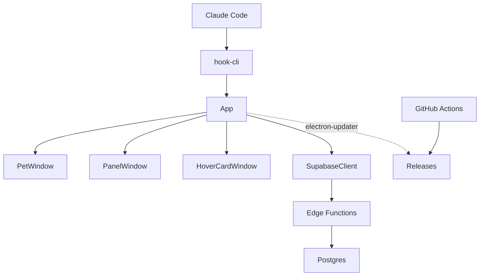

# System overview

claude-mons is an always-on-top Electron desktop pet that levels up by watching Claude Code activity: a Go CLI hook reports session/tool events, the desktop app turns those into XP and shake-triggered battles for a pixel-art creature, and a Supabase backend (Postgres plus Deno Edge Functions) holds the authoritative XP ledger, resolves battles, and serves cross-player leaderboards. The rules that decide leveling, XP, and battle outcomes live once, in `packages/shared`, and run unchanged on both the client and the server.

## Runtime topology

`ClaudeCode` invokes the `hook-cli` binary on every tool call; it posts a stripped-down event envelope to a localhost endpoint owned by the desktop main process, `App` (`apps/desktop/src/main/App.ts`). `App` fans state out over IPC to the three renderers it owns — `PetWindow`, `PanelWindow`, `HoverCardWindow` — and, through `SupabaseClient`, calls the `EdgeFunctions` in `supabase/functions`, which are the only code path allowed to write to `Postgres`. Separately, `GitHubActions` builds and publishes `Releases`, which the packaged app polls via `electron-updater`.

## Repo map

| Path | What lives there | README |
|---|---|---|
| `apps/desktop` | Electron app: main process (windows, IPC, persistence, networking), preload bridge, and the pet/panel/hovercard renderers | `apps/desktop/README.md` |
| `packages/shared` | Dependency-free game rules (levels, XP economy, battle simulator, behavior state machine, species/nations) consumed as source by both runtimes | `packages/shared/README.md` |
| `packages/sprites` | Pixel-art sprites authored as string-row matrices, palettes, and the rasterizer | `packages/sprites/README.md` |
| `packages/hook-cli` | Go binary that reports Claude Code hook events to the desktop app | `packages/hook-cli/README.md` |
| `supabase` | Postgres schema/RLS/RPCs and the Deno Edge Functions | `supabase/README.md` |
| `docs/design` | Game-mechanics specs: economy, battle, species/nations, behavior engine, backend rules | (see [Where to go next](#where-to-go-next)) |
| `.github/workflows` | CI (`.github/workflows/ci.yml`), tagged releases (`.github/workflows/release.yml`), Supabase deploy, and a keepalive cron | — |

## Tech stack

| Layer | Technology | Version | Source |
|---|---|---|---|
| Desktop shell | Electron | `^44.0.0` | `apps/desktop/package.json` |
| Desktop build | electron-vite | `^5.0.0` | `apps/desktop/package.json` |
| Desktop packaging | electron-builder | `^26.0.0` | `apps/desktop/package.json` |
| Panel/hovercard UI | Preact + @preact/signals | `^10.26.0` / `^2.0.0` | `apps/desktop/package.json` |
| Language | TypeScript | `~5.9.3` | `package.json` |
| Hook binary | Go | `1.22` | `packages/hook-cli/go.mod`, `.github/workflows/ci.yml` |
| Edge Functions runtime | Deno | `v2.x` | `.github/workflows/ci.yml`, `supabase/config.toml` |
| Database | Postgres | `17` | `supabase/config.toml` |
| Package manager | pnpm | `10.34.5` | `package.json` (`packageManager`) |
| Test runner | vitest | `^3.2.0` | `package.json` |

## The shared-code rule

`packages/shared` (npm name @claude-mons/shared) ships as TypeScript source rather than a compiled artifact: the Electron main and renderer code imports its `.ts` files directly, and the Edge Functions import a synced copy that `pnpm sync:shared` writes into `supabase/functions/_shared/game`. Because the same source must run under Node (in Electron) and Deno (in Edge Functions) without npm dependencies, it is restricted to web-standard globals — no `node:` imports, relative imports carry explicit `.ts` extensions — and its game/battle logic never calls `Math.random`/`Date.now` directly, taking a seeded RNG and an injected clock from its caller instead. `pnpm deno:check` is the CI gate that proves the synced copy still type-checks under Deno.

## The trust boundary

`hook-cli` runs outside Electron on every Claude Code tool call and is deliberately minimal: it whitelists a small set of stdin fields, strips prompt text, tool input/output, and transcript paths, and posts only the resulting envelope to a localhost endpoint authenticated with a bearer token from `<userData>/hook-endpoint.json`. Inside the desktop app, `App` is the sole owner of persisted state and the sole caller of Supabase, while the pet/panel/hovercard renderers are sandboxed and reach it only through the typed channels in `apps/desktop/src/common/ipc.ts`. On the server, Postgres enforces its own boundary independent of application code: Row Level Security restricts every table to the caller's own rows (or the public leaderboard views), and privileged writes run only through `security definer` RPCs invoked by the Edge Functions' service-role client.

## Where to go next

| Topic | Doc |
|---|---|
| XP economy, leveling, daily caps | `docs/design/economy.md` |
| Battle simulator and rewards | `docs/design/battle.md` |
| Species, nations, sprites | `docs/design/species-and-nations.md` |
| Pet behavior state machine | `docs/design/behavior-engine.md` |
| Database schema, RLS, RPCs | `supabase/README.md` |
| Server-side rules and trust model | `docs/design/backend-rules.md` |
| Desktop app internals | `apps/desktop/README.md` |
| IPC channel contract | `apps/desktop/IPC.md` |
| Shared package details | `packages/shared/README.md` |
| Sprite format and rasterizer | `packages/sprites/README.md` |
| Hook CLI behavior | `packages/hook-cli/README.md` |
| Supabase project layout | `supabase/README.md` |
| Release history | `CHANGELOG.md` |
| Planned work | `docs/ROADMAP.md` |
